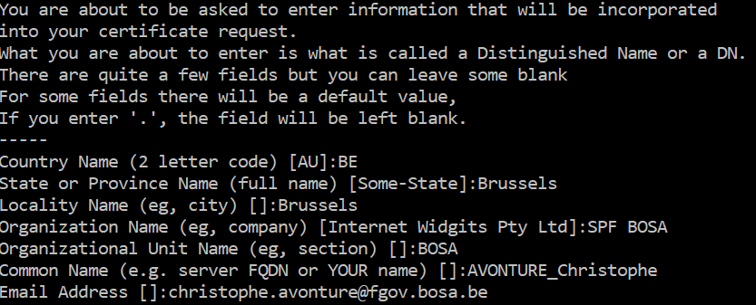

# Install Open_SSL

> https://www.proy.info/how-to-enable-localhost-https-on-wamp-server/

<!-- concat-md::toc -->

If the `open_ssl` Apache module isn't present (**if you see `ssl_module` in the list of Apache module, it isn't the same!**), you'll need to install it.

## Download OpenSSL

Go to http://slproweb.com/products/Win32OpenSSL.html and download the appropriate executable. Under Windows 64 bits, choose f.i. for `Win64 OpenSSL v1.1.0h` and install it locally (f.i. in `C:\Christophe\Tools\OpenSSL\').

## Create SSL Key and Certificate

Once installed, start a command prompt and go to the `C:\Christophe\Tools\OpenSSL\bin\` folder.

Tyoe `openssl genrsa -aes256 -out private.key 2048`.

The system will ask for a passphrase; type f.i. `admin` (or anything else)) and the next steps will remove it...

- Make a copy of the generated file: `copy private.key private.key.backup`
- Run `openssl rsa -in private.key.backup -out private.key` and fill in the previously mentionned passphrase.

Next step is to generate a `certificate.crt` self-signed certificate.

Run `openssl req -new -x509 -sha1 -key private.key -out certificate.crt -days 36500 -config C:\Christophe\Tools\OpenSSL\bin\openssl.cfg` and answer to the different questions:



## Copy the SSL Key and the certificate file

This done, copy the key to Apache configuration folder: `C:\Christophe\Tools\wamp64\bin\apache\apache2.4.23\conf\key` (the `key` folder needs to be created).

```
copy private.key C:\Christophe\Tools\wamp64\bin\apache\apache2.4.23\conf\key\
copy certificate.crt C:\Christophe\Tools\wamp64\bin\apache\apache2.4.23\conf\key\
```

## Open httpd.conf, php.ini & uncomment

Open `C:\Christophe\Tools\wamp64\bin\apache\apache2.4.23\conf\httpd.conf`

Open the `C:\Christophe\Tools\wamp64\bin\php\php7.2.8\php.ini` file, search for `extension=openssl` and make sure the module is loaded. Remove the `;` at the very left if present. Note: the make sure that you're editing the correct php.ini file, run a `php -i` on the command prompt. The full php.ini filename can be retrieved by searching for `Loaded Configuration File`. That variable will return the fullname of the loaded file.

## Open httpd-ssl.conf

Open `C:\Christophe\Tools\wamp64\bin\apache\apache2.4.23\conf\extra\httpd-ssl.conf`, search for `<VirtualHost _default_:443>` and update variables:

```
DocumentRoot "C:/Christophe/Tools/wamp64/www"
ServerName localhost:443
ServerAdmin christophe@localhost
ErrorLog "C:/Christophe/Tools/wamp64/logs/error.log"
TransferLog "C:/Christophe/Tools/wamp64/logs/access.log"
```

Search `SSLSessionCache` and replace by

```
SSLSessionCache "shmcb:C:/Christophe/Tools/wamp64/logs/ssl_scache(512000)"
```

Search `SSLCertificateFile` and replace by

```
SSLCertificateFile "C:/Christophe/Tools/wamp64/bin/apache/apache2.4.23/conf/key/server.crt"
```

Search `SSLCertificateKeyFile` and replace by

```
SSLCertificateKeyFile "C:/Christophe/Tools/wamp64/bin/apache/apache2.4.23/conf/key/private.key"
```

Search `<Directory "c:/Apache24/cgi-bin">` and replace by (what was mentionned for `DocumentRoot`)

```
<Directory "C:/Christophe/Tools/wamp64/www">
```

Search `CustomLog` and replace by

```
CustomLog "C:/Christophe/Tools/wamp64/logs/ssl_request.log" \
          "%t %h %{SSL_PROTOCOL}x %{SSL_CIPHER}x \"%r\" %b"
```

## Copy PHPH DLL to windows folder

```
copy C:\Christophe\Tools\wamp64\bin\php\php7.2.8\ssleay32.dll C:\windows\system32
copy C:\Christophe\Tools\wamp64\bin\php\php7.2.8\libeay32.dll C:\windows\system32
```

## Restart and test

Restart the webserver and test if everything is ok:

Go to `C:\Christophe\Tools\wamp64\bin\apache\apache2.4.23\bin` and run

```
httpd -t
```

The output should be `Syntax is OK`.
