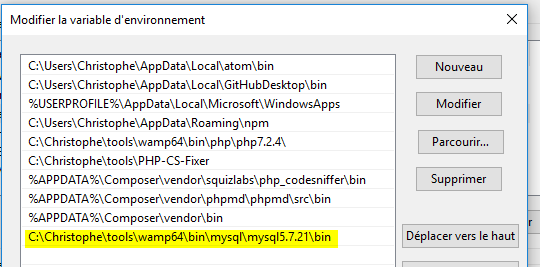

# MySQL

Laravel can work with multiple databases like MySQL, MariaDB, SQL Server, ...

If you wish to run with MySQL, to be able to work with the command prompt, be sure to add the folder in the `PATH` variable under Windows:



When in the path, to connect on MySQL, just run:

```
mysql -u root
```

where `root` is the default username.

When connected, to create a database just execute:

```
CREATE DATABASE dbname;
```
