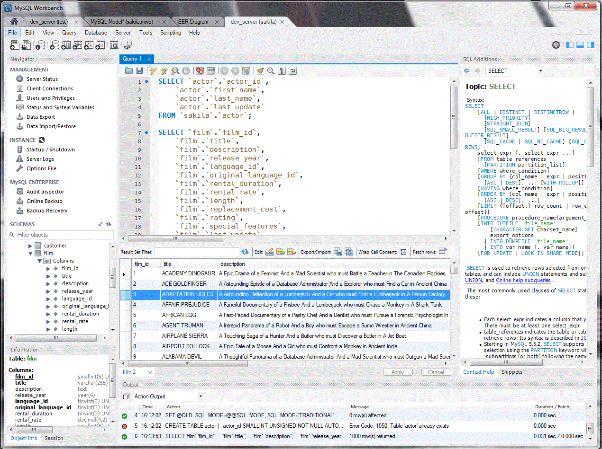

# Tools

These tools are not mandatory but can make life easier

## MySQL Workbench

> http://www.mysql.com/downloads/workbench

MySQL Workbench is a Windows application (not a website) that provide an interface for working with MySQL databases. No need to use phpMyAdmin anymore.

