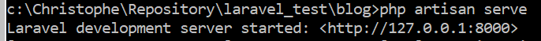
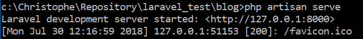

# Running Laravel

> https://laracasts.com/series/laravel-from-scratch-2017/episodes/1

<!-- concat-md::toc -->

## Listen

Under command prompt, from within the Laravel application folder (f.i. `C:\Christophe\Repository\laravel_test\blog`), we can run `php artisan serve`



We can see that the server will listen on a given port. By opening that URL, we can see that any request are echoed:



## Enable the maintenance mode

From a command prompt,

Set the maintenance mode ON:

```
php artisan down
```

Enable the site again

```
php artisan up
```
