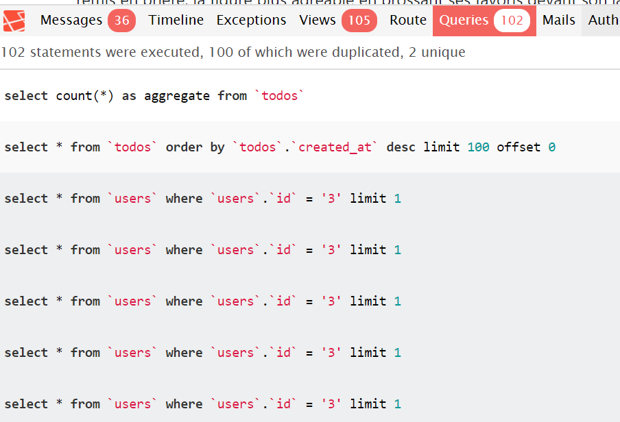

# Eloquent

<!-- concat-md::toc -->

## Create a model

With Eloquent, a table is represented by class which is an extension of a model.

To work with a model, there is an artisan command that will generate for us the model. By convention, if the table is called `Articles`, the model will be `Article` (no plural form)

```
php artisan make:model Article
```

This done, a new file will be created: `/app/Article.php`

```php
<?php

namespace App;

use Illuminate\Database\Eloquent\Model;

class Article extends Model
{
    //
}
```

Now, just update and add our fields

```php
<?php

namespace App;

use Illuminate\Database\Eloquent\Model;

class Article extends Model
{
    protected $table = 'articles';
    public $timestamps = true;
    public $title = '';
    public $content = '';
}
```

If, when creating the table, we've foresee `$table->timestamps();` in the `up()` function, then Laravel has create two fields :

- `created_at`
- `updated_at`

This automatically. To ask to Eloquent to manage these fields, the Model should set the `$timestamps` variable to `true`, `false` otherwise.

## Use the model

Once the model has been created, we then have a class that is, in fact, our table.

To add a new request f.i., we can, in a controller, have something like:

```php
<?php

namespace App\Http\Controllers;

use App\Article;    // use our model
use App\Http\Requests\ArticleRequest;

class ArticleController extends Controller
{
  public function getForm()
  {
    return view('article');
  }

  public function postForm(ArticleRequest $request)
  {
    $article = new Article;
    $article->title = $request->input('title');
    $article->content = $request->input('content');
    $article->save();

    return view('article_ok');
  }

}
```

Thanks the model, fields like `title` and `content` are now properties of the object. Just assign values to them and call the `save()` method.

## Laravel N+1 Query Detector

> https://github.com/beyondcode/laravel-query-detector

When working with a schema having a foreign key (f.i. a table Todos with a user_id field that is a foreign key to the users table so, then, we can retrieve f.i. the name of the author); Laravel will make a lot of queries:

1. One query for retrieving the list of todos (with or without pagination)
2. Then one query by author: if our list has 100 entries, Laravel will make 100 queries even if the author_id is always the same.

So, for instance, consider this example, a todos table with a `user_id` to store the author. That field has foreign key relation with the `id` field of table `users`.

```php
  Schema::create('todos', function (Blueprint $table) {
  // Our primary key
  $table->increments('id');

  // Allow Eloquent to add two fields and managed them:
  // created_at and updated_at
  $table->timestamps();

  $table->string('title', 100);
  $table->boolean('completed')->default(0);
  $table->text('description', 1000)->nullable();

  // The author of the record
  $table->integer('user_id')->unsigned();
  $table->foreign('user_id')->references('id')->on('users')->onDelete('cascade');
  });
```

In our Model, we'll have:

```php
public function user()
{
	return $this->belongsTo('App\User', 'user_id', 'id');
}
```



The image here above has been retrieved thanks to the [Laravel Debugbar](https://github.com/barryvdh/laravel-debugbar). We can see that we'll have a query that will return the first 100 entries (i.e. todos) of the table

```SQL
select * from `todos` order by `todos`.`created_at` desc limit 100 offset 0
```

Then since our page show the name of the author, we've **one** query by todo:

```SQL
select * from `users` where `users`.`id` = '3' limit 1
```

Many things are un-optimized but mainly why repeating that last query more than one? It's always the same user (`3`).

The N+1 Query Detector will put this in highlight and will suggest the solution.

So, first install the package:

```
composer require beyondcode/laravel-query-detector --dev
```

And that is. Nothing else should be done.

Refresh the HTML page and the package will immediately be active:


A javascript has been injected in the page for displaying a message and already give the tip : for the `App\Todo` Model, there is a relation `user` (which is the name of our function that contains the `Belongsto`). The model use the table `todos` so, in the function used by the current view (probably `index` or `getPaginate`), we need to use the `eager loading` feature i.e. add the `:with("user")` parameter.

So, concretely, we'll adapt our repository like below.

If we use a pagination:

```php
public function getPaginate(int $n)
{
  return $this->todo::with('user')
    ->latest('todos.created_at')
    ->paginate($n);
}
```

and, for the `index` function,

```php
public function index() : Collection
{
  return $this->todo::with('user')->all();
}
```

Previously, we had 102 queries (for displaying 100 items). Now, only 3:


The load duration was 756,94 milliseconds without the `::with()` statement and only 263,18 milliseconds then. Nice optimization.{class="note"}

(we can see that the query `select * from users where users.id = '3' limit 1` is now `select * from users where users.id in ('3')`, instead of making one request by author, Laravel will make one for each author (here there is only one))

Read more on [Laracasts](https://laracasts.com/discuss/channels/general-discussion/what-is-the-meaning-of-the-n-1-problem/replies/47286) and take a look on the [video tutorial](https://laracasts.com/lessons/eager-loading).
