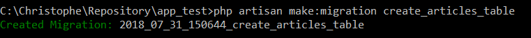
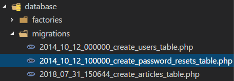

# Working with models and migrations

> https://openclassrooms.com/fr/courses/3613341-decouvrez-le-framework-php-laravel/3617473-migrations-et-modeles

## Configuration of the database

Edit the `/.env` file and fill in information's about the database.

For instance:

```ini
DB_CONNECTION=mysql
DB_HOST=localhost
DB_PORT=3306
DB_DATABASE=tuto
DB_USERNAME=root
DB_PASSWORD=
```

## Create a database

To create a database, open a command prompt and run:

```
mysql -u root
```

where `root` is the default username.

Once successfully connected, to create a database execute:

```
CREATE DATABASE dbname;
```

## Steps

### Install a migration plan

```
php artisan migrate:install
```

A new table will then be created in the database


That table is really important since it'll contains every actiondone on database's schema level.

### Create a migration

If we need to create a new table; for instance, `articles`, we'll run

```
php artisan make:migration create_articles_table
```



Artisan will create a file in the `/databases/migrations` folder.



The file will contains all information's needed for creating (`function up()`) or removing the file (`function down()`). Laravel will assume that we'll have an autonumber field called `id` and a timestamp field.

```php
<?php

use Illuminate\Support\Facades\Schema;
use Illuminate\Database\Schema\Blueprint;
use Illuminate\Database\Migrations\Migration;

class CreateArticlesTable extends Migration
{
  /**
   * Run the migrations.
   *
   * @return void
   */
  public function up()
  {
    Schema::create('articles', function (Blueprint $table) {
      $table->increments('id');
      $table->timestamps();
    });
  }

  /**
   * Reverse the migrations.
   *
   * @return void
   */
  public function down()
  {
    Schema::dropIfExists('articles');
  }
}
```

We'll need to update the `up` function for adding our fields:

```php
  public function up()
  {
    Schema::create('articles', function (Blueprint $table) {
      $table->increments('id');
      $table->string('title', 100);
      $table->string('content', 100);
      $table->timestamps();
    });
  }
```

### Execute a migration

The execution of the migration plan will process each table and really create the tables in the database or removing them.

```
php artisan migrate
```

If everything goes fine

```
c:\Christophe\Repository\app_test>php artisan migrate
Migrating: 2014_10_12_000000_create_users_table
Migrated:  2014_10_12_000000_create_users_table
Migrating: 2014_10_12_100000_create_password_resets_table
Migrated:  2014_10_12_100000_create_password_resets_table
Migrating: 2018_08_01_075115_create_articles_table
Migrated:  2018_08_01_075115_create_articles_table
```

Migrated means create in that case so, now, our database has an article table with the fields defined in the `up()` function.

### Rollback or Refresh

In case of error (incorrect datatype f.i.), it's possible to cancel changes and go back by issuing a rollback:

```
php artisan migrate::rollback
```

But we can also update our migration plan, add, remove or change fields's definition and refresh the structure

For instance, add an author field:

```ini
public function up()
   {
      Schema::create('articles', function (Blueprint $table) {
        // some definition
        $table->string('author', 40);
      });
   }
```

Then

```
php artisan migrate::refresh
```
