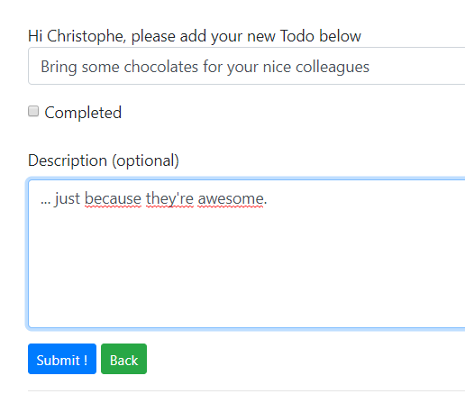

# Create own events

<!-- concat-md::toc -->

## Four steps

We'll need to make four steps:

1. Create an event
2. Create a listener
3. Reference the listener
4. Raise the event

For instance, we'll create a event `TodoCreated` when a new Todo (like `Bring some chocolates for your nice colleagues`) has been submitted. We'll call this event in the controller, after the `store` method so our listener will receive the inserted record and then be able to work with it.

## Create a new event

With artisan:

```
php artisan make:event TodoCreated
```

_(where `TodoCreated` is the name of the event)_

This will process a new file `/app/Events/TodoCreate.php`. Artisan will use a template file with a lot of lines of code but we can make a few cleanings. The minimal code will be:

```php
<?php

namespace App\Events;

use App\Todo;

class TodoCreated
{
	public $todo;

	public function __construct(Todo $todo)
	{
		$this->todo = $todo;
	}
}
```

In the constructor of the event, we specify our model.

So, our event is called **`App\Events\TodoCreated`** i.e. the namespace `App\Events` followed by the class name `TodoCreated`.

Code that will listen our event will receive a `Todo` record (our Model referenced by our `use App\Todo;` sentence).

## Create a listener

With the help of artisan:

```
php artisan make:listener Created --event=App\Todo\TodoCreated
```

_We've called the listener `Created` just because we can't use the same name of the event._

Since we know the name of the event to listen, we can immediatley specify it on the prompt.

This will process a new file `/app/Listeners/Created.php`, we can replace the automatic content with:

```php
<?php

namespace App\Listeners;

use App\Events\TodoCreated;

class Created
{
	public function handle(TodoCreated $event)
	{
		echo '<h1>A todo has been created right now!</h1>' .
			'<pre>' . print_r($event, true) . '</pre>';
		die();
	}
}
```

So, when the `App\Events\TodoCreated` will be raised, we'll `handle()` the event and, here, we'll just echo a sentence and dump the content of the record and stop any further process.

In real world, we'll probably make things like sending a notification to someone (the guy who should take action f.i.) or post the todo on a social network or ...

## Reference the listener

Add the listener in `$listen` in `/app/Providers/EventServiceProvider.php`

```php
protected $listen = [
	...
	'App\Events\TodoCreated' => [
		'App\Listeners\Created',
	],
];
```

Our event is called `App\Events\TodoCreated` and our listener `App\Listeners\Created` so just add that sentence in the `$listen` list.

## Raise the event

The event has been defined (step 1), the listener has been added (step 2) and is listening (step 3), so, last thing is trigger the event (step 4).

Edit the controller where a new Todo is created. This is probably done in file `/app/Http/Controllers/TodoController.php` and add two lines in the file: first add a reference to the event and call it.

```php
use App\Events\TodoCreated;

public function store(TodoRequest $request)
{
	$todo = $this->todoRepository->store($request->all());

	event(new TodoCreated($todo));

	return redirect()->route('todos.show', ['id' => $todo->id])->withOk('Todo has been successfully created');
}
```

## Test TodoCreated

Go to `http://127.0.0.1:8000/todos/create` (i.e. the submission form) and type a new Todo:



Our listener (`/app/Listeners/Created.php`) will then dump the record and stop:


We can see that we've well received a model and, also, the full inserted record. This because the event was triggered after the `store()` in the controller.

The controller was:

```php
use App\Events\TodoCreated;

public function store(TodoRequest $request)
{
	$todo = $this->todoRepository->store($request->all());

	event(new TodoCreated($todo));

	return redirect()->route('todos.show', ['id' => $todo->id])->withOk('Todo has been successfully created');
}
```

A real world example can be:

```php
$bContinue = event(new onBeforeStoreTodo($todo));

if ($bContinue)
{
	$todo = $this->todoRepository->store($request->all());
	event(new onAfterSaveTodo($todo));
}
```

Start a `onBefore` event, listeners will make checks (can the user be able to ..., does the third party is ok, ...) and if yes, store the record and call a `onAfterSave` so new listeners can send notification, log things, ...
