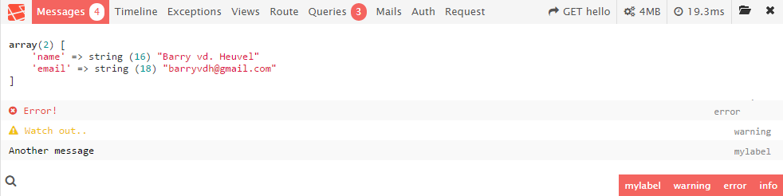
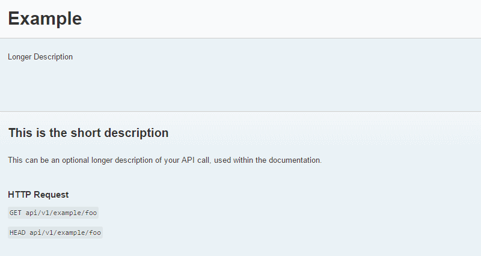

# Tutorials and resources

<!-- concat-md::toc -->

## Tutorials

### English

- On laracasts: [https://laracasts.com/series/laravel-from-scratch-2017](https://laracasts.com/series/laravel-from-scratch-2017)

### French

- Excellent tutorial in French: [https://openclassrooms.com/fr/courses/3613341-decouvrez-le-framework-php-laravel](https://openclassrooms.com/fr/courses/3613341-decouvrez-le-framework-php-laravel)

Also

- Laravel - Un framework qui rend heureux [https://laravel.sillo.org/](https://laravel.sillo.org/) (tutorial for AdminLTE [https://laravel.sillo.org/integrer-adminlte/](https://laravel.sillo.org/integrer-adminlte/)) and [http://laravel-admin.org/](http://laravel-admin.org/)
- Upload d'une image avec Laravel : [https://openclassrooms.com/fr/courses/3613341-decouvrez-le-framework-php-laravel/3617196-configuration-et-session](https://openclassrooms.com/fr/courses/3613341-decouvrez-le-framework-php-laravel/3617196-configuration-et-session)

- Working with Files and Cloud [https://scotch.io/tutorials/understanding-and-working-with-files-in-laravel](https://scotch.io/tutorials/understanding-and-working-with-files-in-laravel)

## Blogs and articles

- [Performance optimization](https://www.cloudways.com/blog/laravel-performance-optimization/)

- [Laravel Page Speed](https://github.com/renatomarinho/laravel-page-speed) Package to optimize your site automatically which results in a 35%+ optimization

## Resources

### Languages

- [List of 68 languages for Laravel 5](https://github.com/caouecs/Laravel-lang)

### Awesome

- [A curated list of awesome bookmarks, packages, tutorials, videos and other cool resources from the Laravel ecosystem](https://github.com/chiraggude/awesome-laravel)

### Packages

#### Authentications

- [Master password](https://github.com/imanghafoori1/laravel-MasterPass)

Master password allows to add a second, unique, password for all users. So, we can connect on the site with the user's own login and with, f.i., `MySecretPassword`. This way the website's owner can test the site with that specific user.

#### Take backups

- [Backup](https://github.com/spatie/laravel-backup); just fire `php artisan backup:run` to start the backup; files and database included.

A package to back up your Laravel app.

- [Take DB snapshots](https://github.com/spatie/laravel-db-snapshots)

#### Coding features

Associate users with roles and permissions

- [Activity log](https://github.com/spatie/laravel-activitylog)

Log activity inside your Laravel app

- [Log viewer](https://github.com/rap2hpoutre/laravel-log-viewer)


- [LogViewer](https://github.com/ARCANEDEV/LogViewer)

- [Permission](https://github.com/spatie/laravel-permission); see [also](https://github.com/chiraggude/awesome-laravel#authentication--authorization)

- [Response cache](https://github.com/spatie/laravel-responsecache)

Speed up a Laravel app by caching the entire response

- [Bootstrap 3 form builder for Laravel](https://github.com/dwightwatson/bootstrap-form)

Generate Bootstrap HTML forms without having to add all tags and DOM elements. Just by using things like `BootForm::text('username');`

#### Extra functionalities

- [elFinder bundle for Laravel](https://github.com/barryvdh/laravel-elfinder)

elFinder (file manager) bundle for Laravel

- [HTML minified](https://github.com/HTMLMin/Laravel-HTMLMin)

A simple HTML minifier for Laravel 5

- [jQuery DataTables](https://github.com/yajra/laravel-datatables)

jQuery DataTables API for Laravel 4|5

- [Markdown](https://github.com/GrahamCampbell/Laravel-Markdown)

A CommonMark wrapper for Laravel 5

- [SEO](https://github.com/artesaos/seotools)

SEO Tools for Laravel

- [Sitemap generator](https://github.com/spatie/laravel-sitemap)

Create and generate sitemaps with ease

- [Text search engine](https://github.com/teamtnt/tntsearch)

Fully featured full text search engine written in PHP

#### Debugging

- [Laravel Debugbar](https://github.com/barryvdh/laravel-debugbar)



- [ClockWork](https://underground.works/clockwork/)

* [Laravel decomposer](https://github.com/lubusIN/laravel-decomposer)


Easily collect information's about the environment, version numbers and installed packages of a Laravel site.

- [Nice artisan](https://github.com/bestmomo/nice-artisan)

Web GUI for running Artisan commands from a web interface

- [View xray](https://github.com/beyondcode/laravel-view-xray)


An HTML output can be the result of several views (multiple extends f.i.). By viewing a form on the browser, View xray will make possible to known which view is responsible for what part.

- [Telescope](https://laravel.com/docs/5.8/telescope)

Laravel Telescope is an elegant debug assistant for the Laravel framework. Telescope provides insight into the requests coming into your application, exceptions, log entries, database queries, queued jobs, mail, notifications, cache operations, scheduled tasks, variable dumps and more. Telescope makes a wonderful companion to your local Laravel development environment.

Tutorial : [Getting started with Laravel Telescope — what can it do for you?](https://blog.logrocket.com/getting-started-with-laravel-telescope-what-can-it-do-for-you-719aaef07941)

- [LERN](https://github.com/tylercd100/lern#lern-laravel-exception-recorder-and-notifier)

LERN from your mistakes

LERN is a Laravel 5 package that will record exceptions into a database and will send you a notification.

**Requires at least Laravel 5.7.7**

#### Testing

- [laravel-auth-tests](https://github.com/dwightwatson/laravel-auth-tests)

PHP Unit test for log-in feature like checking that /login is working, we can log in with a valid user, can't with an invalid one, ...

#### Documentation

- [API Documentation Generator](https://github.com/mpociot/laravel-apidoc-generator)



Laravel API Documentation Generator

#### Utilities

- [Deployer](https://github.com/lorisleiva/laravel-deployer)

Laravel Deployer is a lightweight wrapper of Deployer.org giving Artisan the power of zero-downtime deployment.

- [Videos tutorials](https://www.youtube.com/playlist?list=PLP7iaQb3O2XsexM_5HMrcKNCu0IOcxIDh)

- [Eloquent sluggable](https://github.com/cviebrock/eloquent-sluggable)

Easy creation of slugs for your Eloquent models in Laravel

#### Excel

- [Laravel-Excel](https://github.com/Maatwebsite/Laravel-Excel)

#### Bootstrap

- [laravel-bootstrap-components](https://github.com/appstract/laravel-bootstrap-components)

Allow to write things like below in a Blade template so we don't need to code everytime the Boostrap DOM elements and it's easier to upgrade to a newer version of Bootstrap. Just change the code once for all views. Get the list of all components in the [wiki](https://github.com/appstract/laravel-bootstrap-components/wiki/components)

```php
@component('bootstrap::modal')
	This is the content of the modal
@endcomponent

@component('bootstrap::progress', ['value' => 75])
	// Extra bars
@endcomponent
```

#### Breadcrumb

- [Laravel Breadcrumbs](https://github.com/davejamesmiller/laravel-breadcrumbs)

#### Charts

- [Laravel Charts](https://github.com/kevinkhill/lavacharts)
