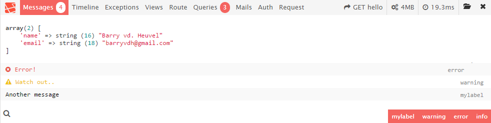
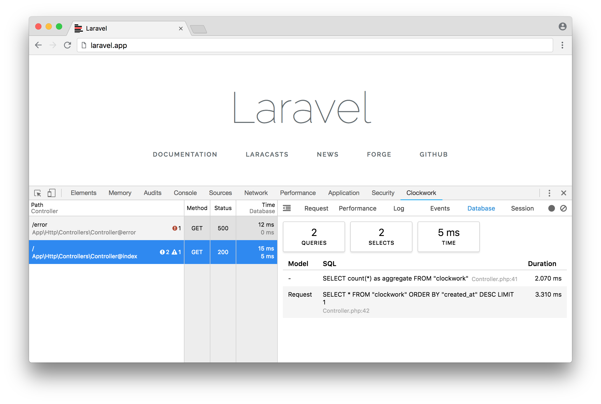
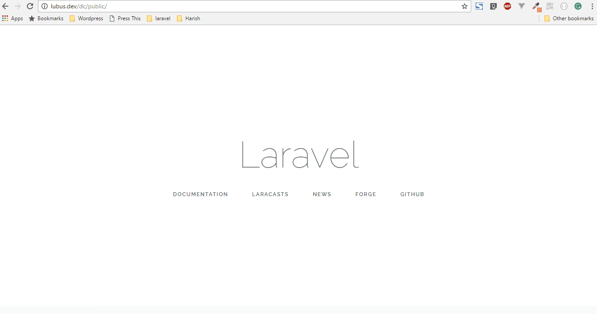

# Debugging

## .env

For enabling / disabling the Debug mode, check the `/.env` file. Adjust the `APP_DEBUG` constant.

## dd for Die and Dump

```php
  $tasks = [];
  $tasks['1'] = 'My first task';
  $tasks['2'] = 'My second task';
  $tasks['3'] = 'My third task';
  $tasks['4'] = 'My last task';

  dd($tasks);   // Die and dump
```

will return

```log
array:4 [▼
  1 => "My first task"
  2 => "My second task"
  3 => "My third task"
  4 => "My last task"
]
```

## Listen executed queries

Just listen DB events... Put a code like here below in your `/app/routes.php` file:

```php
if (env('APP_DEBUG', false)) {
	DB::listen(function ($query) {
		echo '<pre>Query fired ' . $query->sql . '</pre>';
	});
}
```

## Laravel Debugbar

> [https://github.com/barryvdh/laravel-debugbar](https://github.com/barryvdh/laravel-debugbar)



Laravel Debugbar is a very nice additional debug bar that is displayed on the bottom of the page and collect informations about messages, time, exceptions, the name of the displayed views and informations pass to it, etc.

**Laravel Debugbar is a must have!**

To install Laravel Debugbar, just run:

`composer require barryvdh/laravel-debugbar --dev`

## ClockWork

- [https://underground.works/clockwork/](https://underground.works/clockwork/)



PHP Dev tool integrated in the browser developer console (F12). First an addon should be installed ([Chrome](https://chrome.google.com/webstore/detail/clockwork/dmggabnehkmmfmdffgajcflpdjlnoemp) or [Firefox](https://addons.mozilla.org/en-US/firefox/addon/clockwork-dev-tools/)).

To install, just run:

```
composer require itsgoingd/clockwork --dev
```

## Laravel decomposer

- [https://github.com/lubusIN/laravel-decomposer](https://github.com/lubusIN/laravel-decomposer)



Easily collect information's about the environment, version numbers and installed packages of a Laravel site.

To install laravel-decomposer, just run:

`composer require lubusin/laravel-decomposer --dev`
