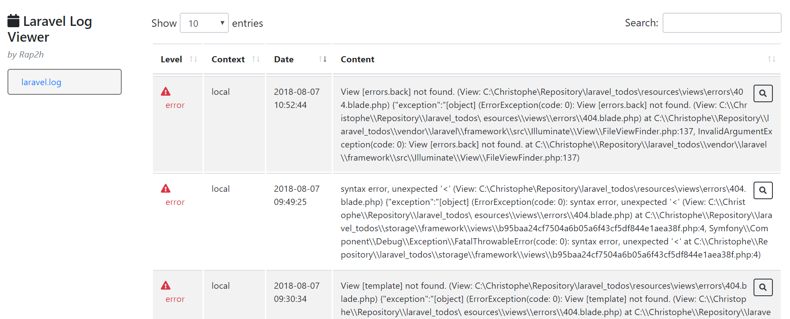
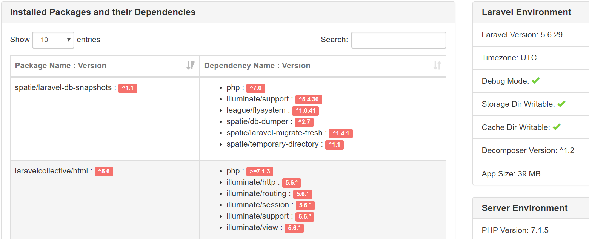

# Error handling

<!-- concat-md::toc -->

## Getting the error log

Laravel store errors in `/storage/logs/laravel.log`.

This file can be consulted online by installing a small helper: [Laravel log viewer](https://github.com/rap2hpoutre/laravel-log-viewer).

### Laravel log viewer

Install the tool:

```
composer require rap2hpoutre/laravel-log-viewer --dev
```

Once installed, just add a route for it:

Edit `/routes/web.php` and add this conditional statement:

```php
if (env('APP_DEBUG', false)) {
  Route::get('logs', '\Rap2hpoutre\LaravelLogViewer\LogViewerController@index');
}
```

The `logs` route will be only valid when `APP_DEBUG` is enabled in the `.env` file. If not (so production mode), the route won't be defined and a 404 error page will be displayed.

_Note: if you edit the `.env` file, you'll need to stop and start again `php artisan serve`_



## Custom HTTP Error Pages

By default, Laravel will check in `/resources/views/errors/` if a view exists for the encountered error.

So, for a 404 error, we just need to create `/resources/views/errors/404.blade.php`

That view can extend our `master` one so the look&feel of the page will be kept.

## Define the 404 page

Create a new `/resources/views/errors/404.blade.php` file with this content:

```html
@extends('master')

@section('content')
<div class="container">
  <div class="row">
    <div class="col-sm">
     <div class="panel-heading">
        <h3 class="panel-title">Houston, we have a problem!</h3>
      </div>
      <div class="panel-body">
        <p>Oups... nothing here</p>
        <a href="{{ route('todos.index') }}" class="back btn btn-sm btn-success">
          <i class="far fa-hand-point-left"></i> Back
        </a>
      </div>
    </div>
    <div class="col-sm">
     <div id="lottie" style="height:250px;" />
    </div>
  </div>
</div>
@endsection

@section('script')
<script src="https://cdnjs.cloudflare.com/ajax/libs/bodymovin/4.13.0/bodymovin.min.js" type="text/javascript"></script>
  <script>
    var animation = bodymovin.loadAnimation({
      container: document.getElementById('lottie'),
      autoplay: true,
      path: 'images/errors/error_404_data.json', // https://www.lottiefiles.com/1408-network-lost
      renderer: 'svg',
      loop: true
    })
  </script>
@endsection
```

The result will be


We'll reuse our `master` view without any changes.

We'll add our content and additional JS scripts.

## Display the content

The `content` section output an informative text and a route to our todo's lists.

```html
<a href="{{ route('todos.index') }}" class="back btn btn-sm btn-success">
  <i class="far fa-hand-point-left"></i> Back
</a>
```

We also foresee a `div` called `lottie` for our animation.

### Use Lottie

> https://github.com/airbnb/lottie-android

> https://laracasts.com/series/whatcha-working-on/episodes/29

> https://www.lottiefiles.com/

Lottie is a JSON animation framework proposed by airbnb for free. Scripts can be found on [Github](https://github.com/airbnb/lottie-android).

There is a [laracast](https://laracasts.com/series/whatcha-working-on/episodes/29) video for teaching how to use Lottie.

In a few words: once the JS script is loaded, we need to have a named `div` in our DOM, an external `JSON` that contains the animation and just play it.

Creating a `lottie` element:

```html
<div id="lottie" style="height:250px;" />
```

Load the `bodymovin` script:

```html
<script src="https://cdnjs.cloudflare.com/ajax/libs/bodymovin/4.13.0/bodymovin.min.js" type="text/javascript"></script>
```

And play it:

```html
<script>
  var animation = bodymovin.loadAnimation({
    container: document.getElementById('lottie'),
    autoplay: true,
    path: 'images/errors/error_404_data.json',
    renderer: 'svg',
    loop: true
  })
</script>
```

Such json file can be found on [lottiefiles](https://www.lottiefiles.com/). Just get any animation, download the `.json` file and store it into the mentioned path (here `images/errors/error_404_data.json`).

## Getting information's on the installation

Part of the resolution is also getting information's about the installation so, we'll install the `decompose` package to do this easily.

Install `laravel-decompose`:

```
composer require lubusin/laravel-decomposer --dev
```

Then create a new route in `/routes/web.php` and add the line in the existing `APP_DEBUG` conditional statement:

```php
if (env('APP_DEBUG', false)) {
  Route::get('logs', '\Rap2hpoutre\LaravelLogViewer\LogViewerController@index');
  Route::get('decompose','\Lubusin\Decomposer\Controllers\DecomposerController@index');
}
```

So, the `decompose` route is only valid when `APP_DEBUG` is enabled in the `.env` file.

_Note: if you edit the `.env` file, you'll need to stop and start again `php artisan serve`_



## Test

Just by trying an inexisting URL like f.i. `http://127.0.0.1:8000/incorrect_route`.

Our 404 animation will then be loaded.

Test also `http://127.0.0.1:8000/logs` and `http://127.0.0.1:8000/decompose`.
