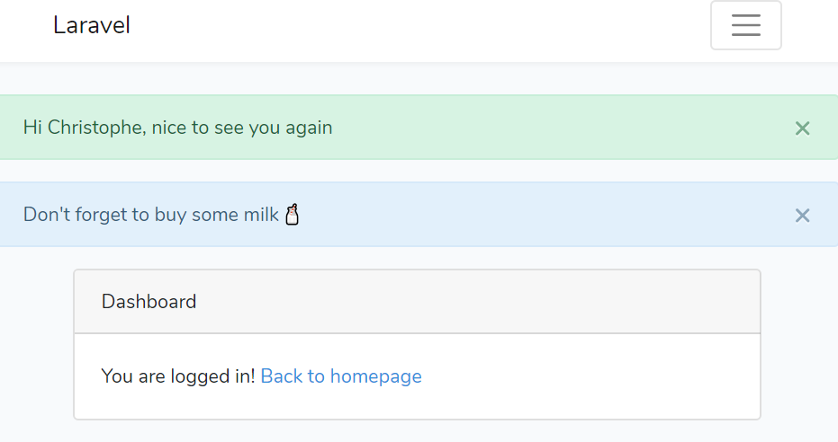

# Login

We'll add a listener for the `Login` event so, each time a user make a login, we'll be able to fire custom code. To make the code scalable, we'll use `arrays` and `loops`.

<!-- concat-md::toc -->

## Attach the listeners

Edit `/app/Providers/EventServiceProvider.php` and update the `$listen` variable like this:

```php
protected $listen = [
	'Illuminate\Auth\Events\Login' => [
		'App\Listeners\LoginSuccess',
		'App\Listeners\LoginSuccessMilk',
	],
	'App\Events\Event' => [
		'App\Listeners\EventListener',
	],
];
```

For the Login event, we've attached two classes, `LoginSuccess` and `LoginSuccessMilk`.

## Create LoginSuccess

Create a file called `/app/Listeners/LoginSuccess.php` with this code:

```php
<?php

namespace App\Listeners;

use Illuminate\Auth\Events\Login;
use Session;

class LoginSuccess
{
	/**
	 * Create the event listener.
	 *
	 * @return void
	 */
	public function __construct()
	{
	}

	/**
	 * Handle the event.
	 *
	 * @param  object $event
	 * @return void
	 */
	public function handle(Login $login)
	{
		$arr = Session::get('message');
		$arr[] = [
			'type' => 'success',
			'message' => 'Hi ' . $login->user->name . ', nice to see you again'
		];
		Session::flash('message', $arr);
	}
}
```

This code is responsible for getting the `message` variable from the Session and store it in a variable:

```php
$arr = Session::get('message');
```

Then add a new entry in the variable (which is / will be an array):

```php
$arr[] = [
	'type' => 'success',
	'message' => 'Hi ' . $login->user->name . ', nice to see you again'
];
```

We define a type (`success`) and a message.

## Create LoginSuccessMilk

Same thing with `/app/Listeners/LoginSuccessMilk.php` (need to be created) with this code:

```php
<?php

namespace App\Listeners;

use Illuminate\Auth\Events\Login;
use Session;

class LoginSuccessMilk
{
	/**
	 * Create the event listener.
	 *
	 * @return void
	 */
	public function __construct()
	{
	}

	/**
	 * Handle the event.
	 *
	 * @param  object $event
	 * @return void
	 */
	public function handle(Login $login)
	{
		$arr = Session::get('message');
		$arr[] = [
			'type' => 'warning',
			'message' => 'Don\'t forget to buy some milk 🥛'
		];
		Session::flash('message', $arr);
	}
}
```

## Display messages

Laravel will display the `home` view once the user is logged-in so, edit the `/resources/views/home.blade.php` and modify the `@section('content')` section like this:

```html
@section('content')

<?php

  if (Session::has('message')) {
  	$alert = '<div class="alert alert-%s alert-dismissible ' .
	  'fade show" role="alert">%s' .
	  '<button type="button" class="close" data-dismiss="alert" ' .
	  'aria-label="Close"><span aria-hidden="true">&times;</span> ' .
	  '</button></div>';

  	foreach (Session::get('message') as $msg) {
  		echo sprintf($alert, $msg['type'], $msg['message']);
  	}
  }

?>

[...]

@endsection
```

We'll put our message before the previous content.

## Test

Go to `http://127.0.0.1:8000/login` and make a connection, Laravel will fire the event, our two listeners will be triggered and:


