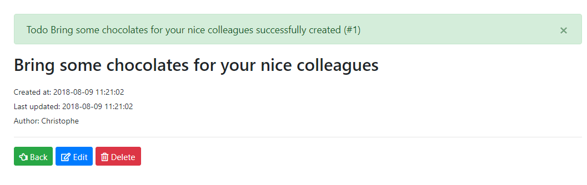

# New Todo event

%TODO_6%

## Objective

In a previous lab, we've coded in `/app/Http/Controllers/TodoController.php`

```php
public function store(TodoRequest $request)
{
	$todo = $this->todoRepository->store($request->all());

	return redirect()->route('todos.show', ['id' => $todo->id])->withOk('Todo has been successfully created');
}
```

The objective, the mantra, is: keep the core as small as possible so, here, we'll suppress the message:

```php
public function store(TodoRequest $request)
{
	$todo = $this->todoRepository->store($request->all());

	return redirect()->route('todos.show', ['id' => $todo->id]);
}
```

But we'll call an event and then show a message in our detail view.

## Implementation

### Create the event

```
php artisan make:event TodoCreated
```

Edit the added file `/app/Events/TodoCreate.php` and replace existing content by this one:ode will be:

```php
<?php

namespace App\Events;

use App\Todo;

class TodoCreated
{
	public $todo;

	public function __construct(Todo $todo)
	{
		$this->todo = $todo;
	}
}
```

### Create the listener

```
php artisan make:listener Created --event=App\Todo\TodoCreated
```

Edit the newly created file `/app/Listeners/Created.php` and use this content:

```php
<?php

namespace App\Listeners;

use App\Events\TodoCreated;
use Session;

class Created
{
	public function handle(TodoCreated $event)
	{
		$arr = Session::get('message');
		$arr[] = [
			'type' => 'success',
			'message' => 'Todo ' . $event->todo->title . ' successfully created '.
				'(#' . $event->todo->id . ')'
		];
		Session::flash('message', $arr);
	}
}
```

### Reference the listener

Edit `/app/Providers/EventServiceProvider.php` and update the `$listen` array:

```php
protected $listen = [
	...
	'App\Events\TodoCreated' => [
		'App\Listeners\Created',
	],
];
```

### Raise the event

Edit `/app/Http/Controllers/TodoController.php` and use this code for the `store()` function:

```php
public function store(TodoRequest $request)
{
	$todo = $this->todoRepository->store($request->all());

	event(new TodoCreated($todo));

	return redirect()->route('todos.show', ['id' => $todo->id]);
}
```

### Display the message

Edit `/resources/views/show.blade.php` and remove the old:

```html
<div class="msg hide alert alert-success alert-dismissible">&nbsp;</div>
```

and replace by:

```html
<?php
  if (Session::has('message')) {
  	$alert = '<div class="alert alert-%s alert-dismissible ' .
	'fade show" role="alert">%s' .
	  '<button type="button" class="close" data-dismiss="alert" ' .
	  'aria-label="Close"><span aria-hidden="true">&times;</span> ' .
	  '</button></div>';

  	foreach (Session::get('message') as $msg) {
  		echo sprintf($alert, $msg['type'], $msg['message']);
  	}
  }
?>
```



Now, we can have several listeners and several possible answer (success, warning, error, ...).

If we wish to disable message, we just need to disable the events; without doing any changes in our view.
