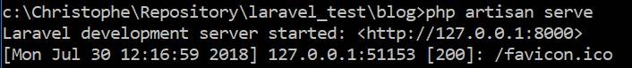
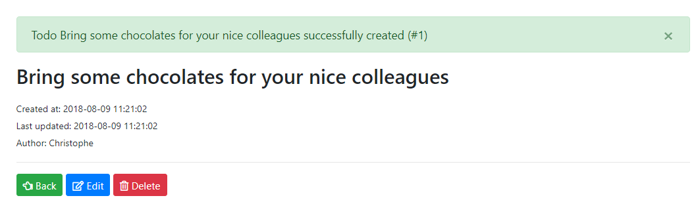

# Laravel

> Based on version 5.6.29

**The code repository can be found on [github](https://github.com/cavo789/laravel_todos)**

<!-- table-of-contents - start -->
* [Installation](#installation)
    * [Installation of laravel](#installation-of-laravel)
       * [Prerequisites](#prerequisites)
       * [Composer](#composer)
       * [Install laravel](#install-laravel)
       * [Run a new installation](#run-a-new-installation)
          * [Force a specific version](#force-a-specific-version)
       * [laravelcollective/html](#laravelcollectivehtml)
    * [Install Open_SSL](#install-open_ssl)
       * [Download OpenSSL](#download-openssl)
       * [Create SSL Key and Certificate](#create-ssl-key-and-certificate)
       * [Copy the SSL Key and the certificate file](#copy-the-ssl-key-and-the-certificate-file)
       * [Open httpd.conf, php.ini & uncomment](#open-httpdconf-phpini-&-uncomment)
       * [Open httpd-ssl.conf](#open-httpd-sslconf)
       * [Copy PHPH DLL to windows folder](#copy-phph-dll-to-windows-folder)
       * [Restart and test](#restart-and-test)
    * [MySQL](#mysql)
    * [Updating Laravel](#updating-laravel)
    * [Configuration](#configuration)
       * [Internationalization](#internationalization)
       * [Files](#files)
          * [.env](#env)
             * [Database](#database)
             * [email](#email)
             * [Debugging](#debugging)
          * [.htaccess](#htaccess)
    * [Handle Authorization Header](#handle-authorization-header)
    * [Redirect Trailing Slashes If Not A Folder...](#redirect-trailing-slashes-if-not-a-folder)
    * [Handle Front Controller...](#handle-front-controller)
       * [Folders](#folders)
          * [public](#public)
       * [Paths](#paths)
          * [Override](#override)
          * [Set our own](#set-our-own)
    * [Tools](#tools)
       * [MySQL Workbench](#mysql-workbench)
* [Running Laravel](#running-laravel)
    * [Listen](#listen)
    * [Enable the maintenance mode](#enable-the-maintenance-mode)
* [Concepts](#concepts)
    * [Middleware](#middleware)
       * [Location](#location)
    * [Working with databases](#working-with-databases)
       * [Eloquent](#eloquent)
          * [Create a model](#create-a-model)
          * [Use the model](#use-the-model)
          * [Laravel N+1 Query Detector](#laravel-n+1-query-detector)
       * [Working with models and migrations](#working-with-models-and-migrations)
          * [Configuration of the database](#configuration-of-the-database)
          * [Create a database](#create-a-database)
          * [Steps](#steps)
             * [Install a migration plan](#install-a-migration-plan)
             * [Create a migration](#create-a-migration)
             * [Execute a migration](#execute-a-migration)
             * [Rollback or Refresh](#rollback-or-refresh)
       * [Laravel Schema Designer](#laravel-schema-designer)
    * [Macros](#macros)
       * [Introduction](#introduction)
       * [Use macro for alerts](#use-macro-for-alerts)
    * [Testing](#testing)
       * [PHPUnit](#phpunit)
          * [Start PHPUnit](#start-phpunit)
          * [Create a new test](#create-a-new-test)
          * [Try assertTrue if false](#try-asserttrue-if-false)
          * [Add some test](#add-some-test)
          * [Posting data](#posting-data)
          * [More complex example](#more-complex-example)
             * [Patch TestCase.php](#patch-testcasephp)
                * [testGuestURLs](#testguesturls)
                * [testPosting](#testposting)
       * [Dusk](#dusk)
          * [Installation](#installation)
          * [Configuration](#configuration)
          * [Command line](#command-line)
    * [Events](#events)
       * [Introduction to events](#introduction-to-events)
       * [Listening events](#listening-events)
          * [Listeners](#listeners)
          * [A few examples](#a-few-examples)
          * [Queries](#queries)
             * [Spy the list of fired queries](#spy-the-list-of-fired-queries)
          * [Listening Login event](#listening-login-event)
             * [Why ?](#why-)
             * [Attach a listener](#attach-a-listener)
             * [Create the listener](#create-the-listener)
             * [Display our message](#display-our-message)
             * [Test Login events](#test-login-events)
             * [Code improvement](#code-improvement)
       * [Create own events](#create-own-events)
          * [Four steps](#four-steps)
          * [Create a new event](#create-a-new-event)
          * [Create a listener](#create-a-listener)
          * [Reference the listener](#reference-the-listener)
          * [Raise the event](#raise-the-event)
          * [Test TodoCreated](#test-todocreated)
* [Errors](#errors)
    * [Installation errors](#installation-errors)
       * [Error creating resource](#error-creating-resource)
       * [xxx requires ext-mbstring](#xxx-requires-ext-mbstring)
    * [Opening the site](#opening-the-site)
       * [Connection refused](#connection-refused)
    * [Database](#database)
       * [Could not found driver](#could-not-found-driver)
       * [SQL error when migrating tables](#sql-error-when-migrating-tables)
       * [The action is unauthorized](#the-action-is-unauthorized)
    * [HTML](#html)
       * [Class xxx not found](#class-xxx-not-found)
* [Tutorials and resources](#tutorials-and-resources)
    * [Tutorials](#tutorials)
       * [English](#english)
       * [French](#french)
    * [Blogs and articles](#blogs-and-articles)
    * [Resources](#resources)
       * [Languages](#languages)
       * [Awesome](#awesome)
       * [Packages](#packages)
          * [Authentications](#authentications)
          * [Take backups](#take-backups)
          * [Coding features](#coding-features)
          * [Extra functionalities](#extra-functionalities)
          * [Debugging](#debugging)
          * [Testing](#testing)
          * [Documentation](#documentation)
          * [Utilities](#utilities)
          * [Excel](#excel)
          * [Bootstrap](#bootstrap)
          * [Breadcrumb](#breadcrumb)
          * [Charts](#charts)
* [Debugging](#debugging)
    * [.env](#env)
    * [dd for Die and Dump](#dd-for-die-and-dump)
    * [Listen executed queries](#listen-executed-queries)
    * [Laravel Debugbar](#laravel-debugbar)
    * [ClockWork](#clockwork)
    * [Laravel decomposer](#laravel-decomposer)
* [Tips](#tips)
    * [General](#general)
       * [Get installed Laravel version](#get-installed-laravel-version)
       * [Update Laravel framework](#update-laravel-framework)
    * [IDE](#ide)
       * [Add autocompletion support for Facades](#add-autocompletion-support-for-facades)
    * [Authentication](#authentication)
       * [Simple Authentication](#simple-authentication)
       * [A way to login with any password while you are in development](#a-way-to-login-with-any-password-while-you-are-in-development)
    * [Documentation](#documentation)
       * [Api](#api)
* [Labs](#labs)
    * [Todos app](#todos-app)
          * [Adding navigation bar](#adding-navigation-bar)
             * [Create the navbar view](#create-the-navbar-view)
             * [Include navbar in master](#include-navbar-in-master)
          * [Blade include](#blade-include)
             * [Problem with show.blade.php](#problem-with-showbladephp)
             * [Create a folder for buttons](#create-a-folder-for-buttons)
             * [Use buttons in existing views](#use-buttons-in-existing-views)
       * [Error handling and testing](#error-handling-and-testing)
          * [Error handling](#error-handling)
             * [Getting the error log](#getting-the-error-log)
                * [Laravel log viewer](#laravel-log-viewer)
             * [Custom HTTP Error Pages](#custom-http-error-pages)
             * [Define the 404 page](#define-the-404-page)
             * [Display the content](#display-the-content)
                * [Use Lottie](#use-lottie)
             * [Getting information's on the installation](#getting-informations-on-the-installation)
             * [Test](#test)
          * [PHPUnit testing](#phpunit-testing)
             * [Create a new test](#create-a-new-test)
             * [Edit the file](#edit-the-file)
             * [Run it](#run-it)
          * [Final code](#final-code)
             * [Install a fresh copy](#install-a-fresh-copy)
             * [Code source](#code-source)
                * [.env](#env)
                * [app](#app)
                   * [app/Todo.php](#apptodophp)
                   * [app/Console/Commands/clear.php](#appconsolecommandsclearphp)
                   * [app/Console/Commands/populate.php](#appconsolecommandspopulatephp)
                   * [app/Http/Controllers/TodoController.php](#apphttpcontrollerstodocontrollerphp)
                   * [app/Http/Requests/TodoRequest.php](#apphttprequeststodorequestphp)
                   * [app/Providers/AppServiceProvider.php](#appprovidersappserviceproviderphp)
                   * [app/Repositories/TodoRepositoryInterface.php](#apprepositoriestodorepositoryinterfacephp)
                   * [app/Repositories/TodoRepository.php](#apprepositoriestodorepositoryphp)
                * [database](#database)
                   * [database/migrations/create_todos_table.php](#databasemigrationscreate_todos_tablephp)
                * [public](#public)
                   * [public/images/errors/error_404_data.json](#publicimageserrorserror_404_datajson)
                * [resources](#resources)
                   * [resources/views/create.blade.php](#resourcesviewscreatebladephp)
                   * [resources/views/edit.blade.php](#resourcesviewseditbladephp)
                   * [resources/views/index.blade.php](#resourcesviewsindexbladephp)
                   * [resources/views/master.blade.php](#resourcesviewsmasterbladephp)
                   * [resources/views/show.blade.php](#resourcesviewsshowbladephp)
                   * [resources/views/errors/404.blade.php](#resourcesviewserrors404bladephp)
                   * [resources/views/buttons/add.blade.php](#resourcesviewsbuttonsaddbladephp)
                   * [resources/views/buttons/back.blade.php](#resourcesviewsbuttonsbackbladephp)
                   * [resources/views/buttons/delete.blade.php](#resourcesviewsbuttonsdeletebladephp)
                   * [resources/views/buttons/edit.blade.php](#resourcesviewsbuttonseditbladephp)
                   * [resources/views/buttons/show.blade.php](#resourcesviewsbuttonsshowbladephp)
                * [routes](#routes)
                   * [routes/web.php](#routeswebphp)
                * [tests](#tests)
                   * [tests/Feature/TodoControllerTest.php](#testsfeaturetodocontrollertestphp)
       * [Events](#events)
          * [Login](#login)
             * [Attach the listeners](#attach-the-listeners)
             * [Create LoginSuccess](#create-loginsuccess)
             * [Create LoginSuccessMilk](#create-loginsuccessmilk)
             * [Display messages](#display-messages)
             * [Test](#test)
          * [New Todo event](#new-todo-event)
             * [Objective](#objective)
             * [Implementation](#implementation)
                * [Create the event](#create-the-event)
                * [Create the listener](#create-the-listener)
                * [Reference the listener](#reference-the-listener)
                * [Raise the event](#raise-the-event)
                * [Display the message](#display-the-message)
          * [Final code](#final-code)
             * [Install a fresh copy](#install-a-fresh-copy)
             * [Code source](#code-source)
                * [.env](#env)
                * [app](#app)
                   * [app/Todo.php](#apptodophp)
                   * [app/Console/Commands/clear.php](#appconsolecommandsclearphp)
                   * [app/Console/Commands/populate.php](#appconsolecommandspopulatephp)
                   * [app/Events/TodoCreated.php](#appeventstodocreatedphp)
                   * [app/Http/Controllers/TodoController.php](#apphttpcontrollerstodocontrollerphp)
                   * [app/Http/Requests/TodoRequest.php](#apphttprequeststodorequestphp)
                   * [app/Listeners/LoginSuccess.php](#applistenersloginsuccessphp)
                   * [app/Listeners/LoginSuccessMilk.php](#applistenersloginsuccessmilkphp)
                   * [app/Providers/AppServiceProvider.php](#appprovidersappserviceproviderphp)
                   * [app/Providers/EventServiceProvider.php](#appproviderseventserviceproviderphp)
                   * [app/Repositories/TodoRepositoryInterface.php](#apprepositoriestodorepositoryinterfacephp)
                   * [app/Repositories/TodoRepository.php](#apprepositoriestodorepositoryphp)
                * [database](#database)
                   * [database/migrations/create_todos_table.php](#databasemigrationscreate_todos_tablephp)
                * [public](#public)
                   * [public/images/errors/error_404_data.json](#publicimageserrorserror_404_datajson)
                * [resources](#resources)
                   * [resources/views/create.blade.php](#resourcesviewscreatebladephp)
                   * [resources/views/edit.blade.php](#resourcesviewseditbladephp)
                   * [resources/views/index.blade.php](#resourcesviewsindexbladephp)
                   * [resources/views/master.blade.php](#resourcesviewsmasterbladephp)
                   * [resources/views/show.blade.php](#resourcesviewsshowbladephp)
                   * [resources/views/errors/404.blade.php](#resourcesviewserrors404bladephp)
                   * [resources/views/buttons/add.blade.php](#resourcesviewsbuttonsaddbladephp)
                   * [resources/views/buttons/back.blade.php](#resourcesviewsbuttonsbackbladephp)
                   * [resources/views/buttons/delete.blade.php](#resourcesviewsbuttonsdeletebladephp)
                   * [resources/views/buttons/edit.blade.php](#resourcesviewsbuttonseditbladephp)
                   * [resources/views/buttons/show.blade.php](#resourcesviewsbuttonsshowbladephp)
                * [routes](#routes)
                   * [routes/web.php](#routeswebphp)
                * [tests](#tests)
                   * [tests/Feature/TodoControllerTest.php](#testsfeaturetodocontrollertestphp)
* [Laravel-Zero](#laravel-zero)
* [License](#license)
<!-- table-of-contents - end -->

%INCLUDE 1. Installation/\*.md%

%INCLUDE 2. Run/\*.md%

%INCLUDE 3. Concepts/\*.md%

%INCLUDE 7. Errors/\*.md%

%INCLUDE 8. Tutorials and resources/\*.md%

%INCLUDE 9. Debugging/\*.md%

%INCLUDE 10. Tips/\*.md%

%INCLUDE A. Labs/\*.md%

%INCLUDE Misc/\*.md%

## Installation

### Installation of laravel

> https://laracasts.com/series/laravel-from-scratch-2017/episodes/1
>
> https://openclassrooms.com/fr/courses/3613341-decouvrez-le-framework-php-laravel/3616434-installation-et-organisation


#### Prerequisites

> https://laravel.com/docs/5.6#server-requirements

(Depending on the version that will be installed)

- PHP >= 7.1.3 (check `php -v` in a command prompt to get installed version)
- [https://getcomposer.org](Composer)

#### Composer

Make sure the `composer` is mentioned in the Windows `Path` variable:

```
%APPDATA%\Composer\vendor\bin
```


#### Install laravel

> If errors occur, look to the [possible errors](../errors/index.html).

From a command prompt:

```
composer global require "laravel/installer"
```

If the `open_ssl` Apache module is not loaded, composer will complain and also suggest disabling the tls mode. This can be done by running `composer config -g -- disable-tls true` but don't do this since the installation process won't be able to install Laravel. **Follow the open_ssl guide if needed (see [open_ssl](../OpenSSL/index.html))**

#### Run a new installation

Once everything is installed correctly, we can run the following command from the prompt:

```
laravel new app_name
```

`app_name` will be the name of the sub-folder that will be created. A fresh installation of Laravel will be done with all dependencies installed.

The output will look like

```
C:\Christophe\Repository>laravel new app_name
Crafting application...
Loading composer repositories with package information
Installing dependencies (including require-dev) from lock file
Package operations: 70 installs, 0 updates, 0 removals
  - Installing doctrine/inflector (v1.3.0): Downloading (100%)
  - Installing doctrine/lexer (v1.0.1): Downloading (100%)
  - Installing dragonmantank/cron-expression (v2.2.0): Downloading (100%)
  - Installing erusev/parsedown (1.7.1): Loading from cache
  - Installing vlucas/phpdotenv (v2.5.1): Downloading (100%)
  - Installing symfony/css-selector (v4.1.2): Downloading (100%)
  - Installing tijsverkoyen/css-to-inline-styles (2.2.1): Downloading (100%)
  - Installing symfony/polyfill-php72 (v1.8.0): Loading from cache
  - Installing symfony/polyfill-mbstring (v1.8.0): Loading from cache
  - Installing symfony/var-dumper (v4.1.2): Downloading (100%)
  - Installing symfony/routing (v4.1.2): Downloading (100%)
  - Installing symfony/process (v4.1.2): Downloading (100%)
  - Installing symfony/polyfill-ctype (v1.8.0): Loading from cache
  - Installing symfony/http-foundation (v4.1.2): Downloading (100%)
  - Installing symfony/event-dispatcher (v4.1.2): Downloading (100%)
  - Installing psr/log (1.0.2): Downloading (100%)
  - Installing symfony/debug (v4.1.2): Downloading (100%)
  - Installing symfony/http-kernel (v4.1.2): Downloading (100%)
  - Installing symfony/finder (v4.1.2): Downloading (100%)
  - Installing symfony/console (v4.1.2): Downloading (100%)
  - Installing egulias/email-validator (2.1.4): Downloading (100%)
  - Installing swiftmailer/swiftmailer (v6.1.2): Downloading (100%)
  - Installing paragonie/random_compat (v9.99.99): Downloading (100%)
  - Installing ramsey/uuid (3.8.0): Downloading (100%)
  - Installing psr/simple-cache (1.0.1): Loading from cache
  - Installing psr/container (1.0.0): Loading from cache
  - Installing symfony/translation (v4.1.2): Downloading (100%)
  - Installing nesbot/carbon (1.25.0): Downloading (100%)
  - Installing monolog/monolog (1.23.0): Downloading (100%)
  - Installing league/flysystem (1.0.45): Loading from cache
  - Installing laravel/framework (v5.6.29): Downloading (100%)
  - Installing fideloper/proxy (4.0.0): Downloading (100%)
  - Installing jakub-onderka/php-console-color (0.1): Downloading (100%)
  - Installing nikic/php-parser (v4.0.3): Downloading (100%)
  - Installing jakub-onderka/php-console-highlighter (v0.3.2): Downloading (100%)
  - Installing dnoegel/php-xdg-base-dir (0.1): Downloading (100%)
  - Installing psy/psysh (v0.9.6): Downloading (100%)
  - Installing laravel/tinker (v1.0.7): Downloading (100%)
  - Installing fzaninotto/faker (v1.8.0): Downloading (100%)
  - Installing hamcrest/hamcrest-php (v2.0.0): Downloading (100%)
  - Installing mockery/mockery (1.1.0): Downloading (100%)
  - Installing filp/whoops (2.2.0): Downloading (100%)
  - Installing nunomaduro/collision (v2.0.3): Downloading (100%)
  - Installing webmozart/assert (1.3.0): Downloading (100%)
  - Installing phpdocumentor/reflection-common (1.0.1): Downloading (100%)
  - Installing phpdocumentor/type-resolver (0.4.0): Downloading (100%)
  - Installing phpdocumentor/reflection-docblock (4.3.0): Downloading (100%)
  - Installing phpunit/php-token-stream (3.0.0): Downloading (100%)
  - Installing sebastian/version (2.0.1): Downloading (100%)
  - Installing sebastian/resource-operations (1.0.0): Downloading (100%)
  - Installing sebastian/recursion-context (3.0.0): Downloading (100%)
  - Installing sebastian/object-reflector (1.1.1): Downloading (100%)
  - Installing sebastian/object-enumerator (3.0.3): Downloading (100%)
  - Installing sebastian/global-state (2.0.0): Downloading (100%)
  - Installing sebastian/exporter (3.1.0): Downloading (100%)
  - Installing sebastian/environment (3.1.0): Downloading (100%)
  - Installing sebastian/diff (3.0.1): Downloading (100%)
  - Installing sebastian/comparator (3.0.2): Downloading (100%)
  - Installing phpunit/php-timer (2.0.0): Downloading (100%)
  - Installing phpunit/php-text-template (1.2.1): Downloading (100%)
  - Installing phpunit/php-file-iterator (2.0.1): Downloading (100%)
  - Installing theseer/tokenizer (1.1.0): Downloading (100%)
  - Installing sebastian/code-unit-reverse-lookup (1.0.1): Downloading (100%)
  - Installing phpunit/php-code-coverage (6.0.7): Downloading (100%)
  - Installing doctrine/instantiator (1.1.0): Downloading (100%)
  - Installing phpspec/prophecy (1.7.6): Downloading (100%)
  - Installing phar-io/version (2.0.1): Downloading (100%)
  - Installing phar-io/manifest (1.0.3): Downloading (100%)
  - Installing myclabs/deep-copy (1.8.1): Downloading (100%)
  - Installing phpunit/phpunit (7.2.7): Downloading (100%)
symfony/var-dumper suggests installing ext-intl (To show region name in time zone dump)
symfony/routing suggests installing doctrine/annotations (For using the annotation loader)
symfony/routing suggests installing symfony/config (For using the all-in-one router or any loader)
symfony/routing suggests installing symfony/dependency-injection (For loading routes from a service)
symfony/routing suggests installing symfony/expression-language (For using expression matching)
symfony/routing suggests installing symfony/yaml (For using the YAML loader)
symfony/event-dispatcher suggests installing symfony/dependency-injection ()
symfony/http-kernel suggests installing symfony/browser-kit ()
symfony/http-kernel suggests installing symfony/config ()
symfony/http-kernel suggests installing symfony/dependency-injection ()
symfony/console suggests installing symfony/lock ()
egulias/email-validator suggests installing ext-intl (PHP Internationalization Libraries are required to use the SpoofChecking validation)
swiftmailer/swiftmailer suggests installing ext-intl (Needed to support internationalized email addresses)
swiftmailer/swiftmailer suggests installing true/punycode (Needed to support internationalized email addresses, if ext-intl is not installed)
paragonie/random_compat suggests installing ext-libsodium (Provides a modern crypto API that can be used to generate random bytes.)
ramsey/uuid suggests installing ext-libsodium (Provides the PECL libsodium extension for use with the SodiumRandomGenerator)
ramsey/uuid suggests installing ext-uuid (Provides the PECL UUID extension for use with the PeclUuidTimeGenerator and PeclUuidRandomGenerator)
ramsey/uuid suggests installing ircmaxell/random-lib (Provides RandomLib for use with the RandomLibAdapter)
ramsey/uuid suggests installing moontoast/math (Provides support for converting UUID to 128-bit integer (in string form).)
ramsey/uuid suggests installing ramsey/uuid-console (A console application for generating UUIDs with ramsey/uuid)
ramsey/uuid suggests installing ramsey/uuid-doctrine (Allows the use of Ramsey\Uuid\Uuid as Doctrine field type.)
symfony/translation suggests installing symfony/config ()
symfony/translation suggests installing symfony/yaml ()
monolog/monolog suggests installing aws/aws-sdk-php (Allow sending log messages to AWS services like DynamoDB)
monolog/monolog suggests installing doctrine/couchdb (Allow sending log messages to a CouchDB server)
monolog/monolog suggests installing ext-amqp (Allow sending log messages to an AMQP server (1.0+ required))
monolog/monolog suggests installing ext-mongo (Allow sending log messages to a MongoDB server)
monolog/monolog suggests installing graylog2/gelf-php (Allow sending log messages to a GrayLog2 server)
monolog/monolog suggests installing mongodb/mongodb (Allow sending log messages to a MongoDB server via PHP Driver)
monolog/monolog suggests installing php-amqplib/php-amqplib (Allow sending log messages to an AMQP server using php-amqplib)
monolog/monolog suggests installing php-console/php-console (Allow sending log messages to Google Chrome)
monolog/monolog suggests installing rollbar/rollbar (Allow sending log messages to Rollbar)
monolog/monolog suggests installing ruflin/elastica (Allow sending log messages to an Elastic Search server)
monolog/monolog suggests installing sentry/sentry (Allow sending log messages to a Sentry server)
league/flysystem suggests installing ext-fileinfo (Required for MimeType)
league/flysystem suggests installing ext-ftp (Allows you to use FTP server storage)
league/flysystem suggests installing league/flysystem-aws-s3-v2 (Allows you to use S3 storage with AWS SDK v2)
league/flysystem suggests installing league/flysystem-aws-s3-v3 (Allows you to use S3 storage with AWS SDK v3)
league/flysystem suggests installing league/flysystem-azure (Allows you to use Windows Azure Blob storage)
league/flysystem suggests installing league/flysystem-cached-adapter (Flysystem adapter decorator for metadata caching)
league/flysystem suggests installing league/flysystem-eventable-filesystem (Allows you to use EventableFilesystem)
league/flysystem suggests installing league/flysystem-rackspace (Allows you to use Rackspace Cloud Files)
league/flysystem suggests installing league/flysystem-sftp (Allows you to use SFTP server storage via phpseclib)
league/flysystem suggests installing league/flysystem-webdav (Allows you to use WebDAV storage)
league/flysystem suggests installing league/flysystem-ziparchive (Allows you to use ZipArchive adapter)
league/flysystem suggests installing spatie/flysystem-dropbox (Allows you to use Dropbox storage)
league/flysystem suggests installing srmklive/flysystem-dropbox-v2 (Allows you to use Dropbox storage for PHP 5 applications)
laravel/framework suggests installing aws/aws-sdk-php (Required to use the SQS queue driver and SES mail driver (~3.0).)
laravel/framework suggests installing doctrine/dbal (Required to rename columns and drop SQLite columns (~2.6).)
laravel/framework suggests installing ext-pcntl (Required to use all features of the queue worker.)
laravel/framework suggests installing ext-posix (Required to use all features of the queue worker.)
laravel/framework suggests installing guzzlehttp/guzzle (Required to use the Mailgun and Mandrill mail drivers and the ping methods on schedules (~6.0).)
laravel/framework suggests installing league/flysystem-aws-s3-v3 (Required to use the Flysystem S3 driver (~1.0).)
laravel/framework suggests installing league/flysystem-cached-adapter (Required to use the Flysystem cache (~1.0).)
laravel/framework suggests installing league/flysystem-rackspace (Required to use the Flysystem Rackspace driver (~1.0).)
laravel/framework suggests installing league/flysystem-sftp (Required to use the Flysystem SFTP driver (~1.0).)
laravel/framework suggests installing nexmo/client (Required to use the Nexmo transport (~1.0).)
laravel/framework suggests installing pda/pheanstalk (Required to use the beanstalk queue driver (~3.0).)
laravel/framework suggests installing predis/predis (Required to use the redis cache and queue drivers (~1.0).)
laravel/framework suggests installing pusher/pusher-php-server (Required to use the Pusher broadcast driver (~3.0).)
laravel/framework suggests installing symfony/dom-crawler (Required to use most of the crawler integration testing tools (~4.0).)
laravel/framework suggests installing symfony/psr-http-message-bridge (Required to psr7 bridging features (~1.0).)
psy/psysh suggests installing ext-pcntl (Enabling the PCNTL extension makes PsySH a lot happier :))
psy/psysh suggests installing ext-pdo-sqlite (The doc command requires SQLite to work.)
psy/psysh suggests installing ext-posix (If you have PCNTL, you'll want the POSIX extension as well.)
psy/psysh suggests installing hoa/console (A pure PHP readline implementation. You'll want this if your PHP install doesn't already support readline or libedit.)
filp/whoops suggests installing whoops/soap (Formats errors as SOAP responses)
sebastian/global-state suggests installing ext-uopz (*)
phpunit/php-code-coverage suggests installing ext-xdebug (^2.6.0)
phpunit/phpunit suggests installing ext-soap (*)
phpunit/phpunit suggests installing ext-xdebug (*)
phpunit/phpunit suggests installing phpunit/php-invoker (^2.0)
Generating optimized autoload files
> @php -r "file_exists('.env') || copy('.env.example', '.env');"
> @php artisan key:generate
Application key [base64:Y7tueyvvLR6G/UFNPOLAC9N23OX8ZoD0qJYuRZ9GoD0=] set successfully.
> Illuminate\Foundation\ComposerScripts::postAutoloadDump
> @php artisan package:discover
Discovered Package: fideloper/proxy
Discovered Package: laravel/tinker
Discovered Package: nunomaduro/collision
Package manifest generated successfully.
Application ready! Build something amazing.
```

By going into the `app_name` folder, to retrieve the Lavaral version information, just run from a command prompt:

```
php artisan -V
```

If everything was fine, the version of Laravel should be displayed:

```
C:\Christophe\Repository\app_name>php artisan -V
Laravel Framework 5.6.29
```

When finished, the result of `laraval new app_name` will be a folder structure like this:


##### Force a specific version

For forcing a given version of Laravel, use a syntax like

```
composer create-project laravel/laravel="5.6.39" appName
```

#### laravelcollective/html

> https://laravelcollective.com/docs/5.2/html

Laravel has a helper for working with HTML: `laravelcollective/html`.

This package was installed by default before v5 so, if needed, this package should be installed manually, this can be easily done thanks to:

```
composer require "laravelcollective/html":"^5.2.0"
```

That package will allow f.i. creating HTML forms, adding css or js, ...

See [https://laravelcollective.com/docs/5.2/html#installation](https://laravelcollective.com/docs/5.2/html#installation) for more installation steps.

### Install Open_SSL

> https://www.proy.info/how-to-enable-localhost-https-on-wamp-server/


If the `open_ssl` Apache module isn't present (**if you see `ssl_module` in the list of Apache module, it isn't the same!**), you'll need to install it.

#### Download OpenSSL

Go to http://slproweb.com/products/Win32OpenSSL.html and download the appropriate executable. Under Windows 64 bits, choose f.i. for `Win64 OpenSSL v1.1.0h` and install it locally (f.i. in `C:\Christophe\Tools\OpenSSL\').

#### Create SSL Key and Certificate

Once installed, start a command prompt and go to the `C:\Christophe\Tools\OpenSSL\bin\` folder.

Tyoe `openssl genrsa -aes256 -out private.key 2048`.

The system will ask for a passphrase; type f.i. `admin` (or anything else)) and the next steps will remove it...

- Make a copy of the generated file: `copy private.key private.key.backup`
- Run `openssl rsa -in private.key.backup -out private.key` and fill in the previously mentionned passphrase.

Next step is to generate a `certificate.crt` self-signed certificate.

Run `openssl req -new -x509 -sha1 -key private.key -out certificate.crt -days 36500 -config C:\Christophe\Tools\OpenSSL\bin\openssl.cfg` and answer to the different questions:


#### Copy the SSL Key and the certificate file

This done, copy the key to Apache configuration folder: `C:\Christophe\Tools\wamp64\bin\apache\apache2.4.23\conf\key` (the `key` folder needs to be created).

```
copy private.key C:\Christophe\Tools\wamp64\bin\apache\apache2.4.23\conf\key\
copy certificate.crt C:\Christophe\Tools\wamp64\bin\apache\apache2.4.23\conf\key\
```

#### Open httpd.conf, php.ini & uncomment

Open `C:\Christophe\Tools\wamp64\bin\apache\apache2.4.23\conf\httpd.conf`

Open the `C:\Christophe\Tools\wamp64\bin\php\php7.2.8\php.ini` file, search for `extension=openssl` and make sure the module is loaded. Remove the `;` at the very left if present. Note: the make sure that you're editing the correct php.ini file, run a `php -i` on the command prompt. The full php.ini filename can be retrieved by searching for `Loaded Configuration File`. That variable will return the fullname of the loaded file.

#### Open httpd-ssl.conf

Open `C:\Christophe\Tools\wamp64\bin\apache\apache2.4.23\conf\extra\httpd-ssl.conf`, search for `<VirtualHost _default_:443>` and update variables:

```
DocumentRoot "C:/Christophe/Tools/wamp64/www"
ServerName localhost:443
ServerAdmin christophe@localhost
ErrorLog "C:/Christophe/Tools/wamp64/logs/error.log"
TransferLog "C:/Christophe/Tools/wamp64/logs/access.log"
```

Search `SSLSessionCache` and replace by

```
SSLSessionCache "shmcb:C:/Christophe/Tools/wamp64/logs/ssl_scache(512000)"
```

Search `SSLCertificateFile` and replace by

```
SSLCertificateFile "C:/Christophe/Tools/wamp64/bin/apache/apache2.4.23/conf/key/server.crt"
```

Search `SSLCertificateKeyFile` and replace by

```
SSLCertificateKeyFile "C:/Christophe/Tools/wamp64/bin/apache/apache2.4.23/conf/key/private.key"
```

Search `<Directory "c:/Apache24/cgi-bin">` and replace by (what was mentionned for `DocumentRoot`)

```
<Directory "C:/Christophe/Tools/wamp64/www">
```

Search `CustomLog` and replace by

```
CustomLog "C:/Christophe/Tools/wamp64/logs/ssl_request.log" \
          "%t %h %{SSL_PROTOCOL}x %{SSL_CIPHER}x \"%r\" %b"
```

#### Copy PHPH DLL to windows folder

```
copy C:\Christophe\Tools\wamp64\bin\php\php7.2.8\ssleay32.dll C:\windows\system32
copy C:\Christophe\Tools\wamp64\bin\php\php7.2.8\libeay32.dll C:\windows\system32
```

#### Restart and test

Restart the webserver and test if everything is ok:

Go to `C:\Christophe\Tools\wamp64\bin\apache\apache2.4.23\bin` and run

```
httpd -t
```

The output should be `Syntax is OK`.

### MySQL

Laravel can work with multiple databases like MySQL, MariaDB, SQL Server, ...

If you wish to run with MySQL, to be able to work with the command prompt, be sure to add the folder in the `PATH` variable under Windows:


When in the path, to connect on MySQL, just run:

```
mysql -u root
```

where `root` is the default username.

When connected, to create a database just execute:

```
CREATE DATABASE dbname;
```

### Updating Laravel

Once Laravel has been installed and you're working on a project, for updating the Laravel code base and any dependencies used by Laravel, just use composer. In a command prompt, go to the application folder (like `app_test`), then run:

```
composer update
```


### Configuration


#### Internationalization

Languages can be retrieved from [https://github.com/caouecs/Laravel-lang](https://github.com/caouecs/Laravel-lang).

Languages should be copied into the folder `/resources/lang`.

#### Files

##### .env

###### Database

The `.env` file in the root folder will contains configurations items like the datababase's credentials.

```ini
DB_CONNECTION=mysql
DB_HOST=127.0.0.1
DB_PORT=3306
DB_DATABASE=homestead
DB_USERNAME=homestead
DB_PASSWORD=secret
```

###### email

```ini
MAIL_DRIVER=smtp
MAIL_HOST=smtp.xxxxx.com
MAIL_PORT=25
MAIL_USERNAME=null
MAIL_PASSWORD=null
MAIL_ENCRYPTION=null
```

###### Debugging

The `.env` file contains a constant called `APP_DEBUG`. By setting that variable to `true`, additional errors messages will be displayed.

By putting the application to the production environment, don't forget to set `APP_DEBUG` to `false`.

##### .htaccess

The `.htaccess` file of Laravel is located under `/public/.htaccess` and contains, by default:

```
<IfModule mod_rewrite.c>
   <IfModule mod_negotiation.c>
      Options -MultiViews -Indexes
   </IfModule>

   RewriteEngine On

   ### Handle Authorization Header
   RewriteCond %{HTTP:Authorization} .
   RewriteRule .* - [E=HTTP_AUTHORIZATION:%{HTTP:Authorization}]

   ### Redirect Trailing Slashes If Not A Folder...
   RewriteCond %{REQUEST_FILENAME} !-d
   RewriteCond %{REQUEST_URI} (.+)/$
   RewriteRule ^ %1 [L,R=301]

   ### Handle Front Controller...
   RewriteCond %{REQUEST_FILENAME} !-d
   RewriteCond %{REQUEST_FILENAME} !-f
   RewriteRule ^ index.php [L]
</IfModule>
```

#### Folders

##### public

The only one folder that needs to be accessible to the user through the web. That means that, without exceptions, all the rest (folders `app`, `bootstrap`, `config`, `database`, ...) shouldn't be accessible from the web.

The `public` folder is also the only one with a 755 `chmod`.

#### Paths

##### Override

It's possible to overwrite default paths like, f.i., the paths for the views.

By default, it's `/resources/views` but we can change it by using the method `Config::set()`

```
Config::set('view.paths', [base_path().'/my_own_view_path']);
```

##### Set our own

We can create our one paths like one for images, documentations, ...

To respect the Laravel's framework, we just need to add a file in the `/config` folder, f.i. adding `/config/images.php`.

```php
<?php
return ['path' => 'uploads'];
```

The content is really straightforward: the return is an associative array (key->value).

When added, we can immediately use it:

```php
echo config('images.path');
```

### Tools

These tools are not mandatory but can make life easier

#### MySQL Workbench

> http://www.mysql.com/downloads/workbench

MySQL Workbench is a Windows application (not a website) that provide an interface for working with MySQL databases. No need to use phpMyAdmin anymore.


## Running Laravel

> https://laracasts.com/series/laravel-from-scratch-2017/episodes/1


### Listen

Under command prompt, from within the Laravel application folder (f.i. `C:\Christophe\Repository\laravel_test\blog`), we can run `php artisan serve`


We can see that the server will listen on a given port. By opening that URL, we can see that any request are echoed:



### Enable the maintenance mode

From a command prompt,

Set the maintenance mode ON:

```
php artisan down
```

Enable the site again

```
php artisan up
```

## Concepts

### Middleware

> https://openclassrooms.com/fr/courses/3613341-decouvrez-le-framework-php-laravel/3616909-les-entrees#/id/r-3616818


A middleware defines the code to run by entering or leaving a request in a "context" (the middleware).

By default, two middlewares are defined: `web` and `api`.

We can f.i. define a new one called `admin` and thanks to this, perform a check 'can the current user use the admin part?': by opening `admin` a validation code will then be fired, automatically, on each admin request. This makes things easy.

#### Location

The middleware is defined in the `/app/Http/Kernel.php` file:

```php
protected $middlewareGroups = [
  'web' => [
    \App\Http\Middleware\EncryptCookies::class,
    \Illuminate\Cookie\Middleware\AddQueuedCookiesToResponse::class,
    \Illuminate\Session\Middleware\StartSession::class,
    // \Illuminate\Session\Middleware\AuthenticateSession::class,
    \Illuminate\View\Middleware\ShareErrorsFromSession::class,
    \App\Http\Middleware\VerifyCsrfToken::class,
    \Illuminate\Routing\Middleware\SubstituteBindings::class,
  ],
  'api' => [
    'throttle:60,1',
    'bindings',
  ],
];
```

We can see that, for `web`, cookies, session and the CSRF token f.i. will be loaded and not for `api`.

The `web` middleware is the default one: every single route defined in `/app/Http/routes.php`, if nothing is specified, are `web` routes.

### Working with databases

#### Eloquent


##### Create a model

With Eloquent, a table is represented by class which is an extension of a model.

To work with a model, there is an artisan command that will generate for us the model. By convention, if the table is called `Articles`, the model will be `Article` (no plural form)

```
php artisan make:model Article
```

This done, a new file will be created: `/app/Article.php`

```php
<?php

namespace App;

use Illuminate\Database\Eloquent\Model;

class Article extends Model
{
    //
}
```

Now, just update and add our fields

```php
<?php

namespace App;

use Illuminate\Database\Eloquent\Model;

class Article extends Model
{
    protected $table = 'articles';
    public $timestamps = true;
    public $title = '';
    public $content = '';
}
```

If, when creating the table, we've foresee `$table->timestamps();` in the `up()` function, then Laravel has create two fields :

- `created_at`
- `updated_at`

This automatically. To ask to Eloquent to manage these fields, the Model should set the `$timestamps` variable to `true`, `false` otherwise.

##### Use the model

Once the model has been created, we then have a class that is, in fact, our table.

To add a new request f.i., we can, in a controller, have something like:

```php
<?php

namespace App\Http\Controllers;

use App\Article;    // use our model
use App\Http\Requests\ArticleRequest;

class ArticleController extends Controller
{
  public function getForm()
  {
    return view('article');
  }

  public function postForm(ArticleRequest $request)
  {
    $article = new Article;
    $article->title = $request->input('title');
    $article->content = $request->input('content');
    $article->save();

    return view('article_ok');
  }

}
```

Thanks the model, fields like `title` and `content` are now properties of the object. Just assign values to them and call the `save()` method.

##### Laravel N+1 Query Detector

> https://github.com/beyondcode/laravel-query-detector

When working with a schema having a foreign key (f.i. a table Todos with a user_id field that is a foreign key to the users table so, then, we can retrieve f.i. the name of the author); Laravel will make a lot of queries:

1. One query for retrieving the list of todos (with or without pagination)
2. Then one query by author: if our list has 100 entries, Laravel will make 100 queries even if the author_id is always the same.

So, for instance, consider this example, a todos table with a `user_id` to store the author. That field has foreign key relation with the `id` field of table `users`.

```php
  Schema::create('todos', function (Blueprint $table) {
  // Our primary key
  $table->increments('id');

  // Allow Eloquent to add two fields and managed them:
  // created_at and updated_at
  $table->timestamps();

  $table->string('title', 100);
  $table->boolean('completed')->default(0);
  $table->text('description', 1000)->nullable();

  // The author of the record
  $table->integer('user_id')->unsigned();
  $table->foreign('user_id')->references('id')->on('users')->onDelete('cascade');
  });
```

In our Model, we'll have:

```php
public function user()
{
	return $this->belongsTo('App\User', 'user_id', 'id');
}
```


The image here above has been retrieved thanks to the [Laravel Debugbar](https://github.com/barryvdh/laravel-debugbar). We can see that we'll have a query that will return the first 100 entries (i.e. todos) of the table

```SQL
select * from `todos` order by `todos`.`created_at` desc limit 100 offset 0
```

Then since our page show the name of the author, we've **one** query by todo:

```SQL
select * from `users` where `users`.`id` = '3' limit 1
```

Many things are un-optimized but mainly why repeating that last query more than one? It's always the same user (`3`).

The N+1 Query Detector will put this in highlight and will suggest the solution.

So, first install the package:

```
composer require beyondcode/laravel-query-detector --dev
```

And that is. Nothing else should be done.

Refresh the HTML page and the package will immediately be active:


A javascript has been injected in the page for displaying a message and already give the tip : for the `App\Todo` Model, there is a relation `user` (which is the name of our function that contains the `Belongsto`). The model use the table `todos` so, in the function used by the current view (probably `index` or `getPaginate`), we need to use the `eager loading` feature i.e. add the `:with("user")` parameter.

So, concretely, we'll adapt our repository like below.

If we use a pagination:

```php
public function getPaginate(int $n)
{
  return $this->todo::with('user')
    ->latest('todos.created_at')
    ->paginate($n);
}
```

and, for the `index` function,

```php
public function index() : Collection
{
  return $this->todo::with('user')->all();
}
```

Previously, we had 102 queries (for displaying 100 items). Now, only 3:


The load duration was 756,94 milliseconds without the `::with()` statement and only 263,18 milliseconds then. Nice optimization.{class="note"}

(we can see that the query `select * from users where users.id = '3' limit 1` is now `select * from users where users.id in ('3')`, instead of making one request by author, Laravel will make one for each author (here there is only one))

Read more on [Laracasts](https://laracasts.com/discuss/channels/general-discussion/what-is-the-meaning-of-the-n-1-problem/replies/47286) and take a look on the [video tutorial](https://laracasts.com/lessons/eager-loading).

#### Working with models and migrations

> https://openclassrooms.com/fr/courses/3613341-decouvrez-le-framework-php-laravel/3617473-migrations-et-modeles

##### Configuration of the database

Edit the `/.env` file and fill in information's about the database.

For instance:

```ini
DB_CONNECTION=mysql
DB_HOST=localhost
DB_PORT=3306
DB_DATABASE=tuto
DB_USERNAME=root
DB_PASSWORD=
```

##### Create a database

To create a database, open a command prompt and run:

```
mysql -u root
```

where `root` is the default username.

Once successfully connected, to create a database execute:

```
CREATE DATABASE dbname;
```

##### Steps

###### Install a migration plan

```
php artisan migrate:install
```

A new table will then be created in the database


That table is really important since it'll contains every actiondone on database's schema level.

###### Create a migration

If we need to create a new table; for instance, `articles`, we'll run

```
php artisan make:migration create_articles_table
```


Artisan will create a file in the `/databases/migrations` folder.


The file will contains all information's needed for creating (`function up()`) or removing the file (`function down()`). Laravel will assume that we'll have an autonumber field called `id` and a timestamp field.

```php
<?php

use Illuminate\Support\Facades\Schema;
use Illuminate\Database\Schema\Blueprint;
use Illuminate\Database\Migrations\Migration;

class CreateArticlesTable extends Migration
{
  /**
   * Run the migrations.
   *
   * @return void
   */
  public function up()
  {
    Schema::create('articles', function (Blueprint $table) {
      $table->increments('id');
      $table->timestamps();
    });
  }

  /**
   * Reverse the migrations.
   *
   * @return void
   */
  public function down()
  {
    Schema::dropIfExists('articles');
  }
}
```

We'll need to update the `up` function for adding our fields:

```php
  public function up()
  {
    Schema::create('articles', function (Blueprint $table) {
      $table->increments('id');
      $table->string('title', 100);
      $table->string('content', 100);
      $table->timestamps();
    });
  }
```

###### Execute a migration

The execution of the migration plan will process each table and really create the tables in the database or removing them.

```
php artisan migrate
```

If everything goes fine

```
c:\Christophe\Repository\app_test>php artisan migrate
Migrating: 2014_10_12_000000_create_users_table
Migrated:  2014_10_12_000000_create_users_table
Migrating: 2014_10_12_100000_create_password_resets_table
Migrated:  2014_10_12_100000_create_password_resets_table
Migrating: 2018_08_01_075115_create_articles_table
Migrated:  2018_08_01_075115_create_articles_table
```

Migrated means create in that case so, now, our database has an article table with the fields defined in the `up()` function.

###### Rollback or Refresh

In case of error (incorrect datatype f.i.), it's possible to cancel changes and go back by issuing a rollback:

```
php artisan migrate::rollback
```

But we can also update our migration plan, add, remove or change fields's definition and refresh the structure

For instance, add an author field:

```ini
public function up()
   {
      Schema::create('articles', function (Blueprint $table) {
        // some definition
        $table->string('author', 40);
      });
   }
```

Then

```
php artisan migrate::refresh
```

#### Laravel Schema Designer

> https://openclassrooms.com/fr/courses/3613341-decouvrez-le-framework-php-laravel/3618722-les-commandes-et-les-assistants#/id/r-3618715

[Schema Designer](http://www.laravelsd.com/) is an impressive tool that will generate PHP source code for your database. Just draw tables, define tables, fields and attributes, ... and click on the `Export All` button to receive PHP files that you just need to put in your Laravel project.


Awesome!

### Macros


> https://openclassrooms.com/fr/courses/3613341-decouvrez-le-framework-php-laravel/3619068-des-vues-propres-1-2#/id/r-3619045

#### Introduction

When working with a framework like Bootstrap f.i., we'll have a lot of views that will contains Bootstrap styles, how to display a button, create an accordion, ...

If the framework evolves and changes its way of doing such things, we'll need to change a lot of views.

The idea behind `macros` is to use a "word" and replace that word at runtime by something else.

For instance, here is the code for displaying a text input in a Bootstrap form:

```php
<div class="form-group {!! $errors->has('titre') ? 'has-error' : '' !!}">
	{!! Form::text('titre', null, ['class' => 'form-control', 'placeholder' => 'Titre']) !!}
	{!! $errors->first('titre', '<small class="help-block">:message</small>') !!}
</div>
```

With a macro, we'll be able to have:

```php
{!! Form::control('text', $errors, 'titre', 'Titre') !!}
```

If we use such feature in all of our forms, then it's easy to migrate from Bootstrap 2 to 4 by just reviewing how `Form::control` works and use the new-of-way of making form's entries with the new version of the framework.

#### Use macro for alerts

In two or more views, we've things like:

```html
<?php
  if (Session::has('message')) {
  	$alert = '<div class="alert alert-%s alert-dismissible ' .
	'fade show" role="alert">%s' .
	  '<button type="button" class="close" data-dismiss="alert" ' .
	  'aria-label="Close"><span aria-hidden="true">&times;</span> ' .
	  '</button></div>';

  	foreach (Session::get('message') as $msg) {
  		echo sprintf($alert, $msg['type'], $msg['message']);
  	}
  }
?>
```

We're too dependent on Bootstrap; with a newer version of Bootstrap perhaps the way of displaying an alert will be modified so we'll need to update more than one view.

We'll then create a `Html::alert` so we can call that macro in all views so, in case of change, we'll just need to update one location instead of all views using such feature.

### Testing


%INCLUDE 1. PHPUnit/index.md%

%INCLUDE 2. Dusk/index.md%


#### PHPUnit

> https://laravel.com/docs/5.6/http-tests

Laravel is using [PHPUnit](https://phpunit.de/) and is already available: just open a prompt and start `vendor\bin\phpunit.bat`.

The PHPUnit package is installed as a dependency of Laravel in development mode.

##### Start PHPUnit

While `vendor\bin\phpunit.bat` is accessible, the .php script can be manually fired like this:

```
php vendor\phpunit\phpunit\phpunit -h
```

##### Create a new test

To create a test controller, just run:

```
php artisan make:test MyControllerTest
```

Attention: the filename SHOULD ends with Test.php like `MyControllerTest.php`. PHP_Unit will only process such files while getting the list of .php to process.{class=red}

This will create the file `/tests/Feature/MyControllerTest.php` with this content:

```php
<?php

namespace Tests\Feature;

use Tests\TestCase;

class MyControllerTest extends TestCase
{
  public function testExample()
  {
    $this->assertTrue(true);
  }
}
```

To run it, we just need to open a DOS session and call PHPUnit:

```
vendor\bin\phpunit.bat
```

Note: we can also add options like, f.i.:

```
vendor\bin\phpunit.bat --stop-on-error
```

The list of options can be found at [https://phpunit.de/manual/6.5/en/textui.html](https://phpunit.de/manual/6.5/en/textui.html). Also by running:

```
vendor\bin\phpunit.bat -h
```

The result should be:

```
PHPUnit 7.2.7 by Sebastian Bergmann and contributors.

.                                                                   1 / 1 (100%)

Time: 171 ms, Memory: 12.00MB

OK (1 test, 1 assertion)
```

##### Try assertTrue if false

By updating the function to false, we'll then fake an error:

```php
<?php

namespace Tests\Feature;

use Tests\TestCase;

class MyControllerTest extends TestCase
{
  public function testExample()
  {
    $this->assertTrue(false);      ' <-- false will then invalidate the assertion
  }
}
```

Now, we've one error. PHPUnit is also reporting information's about the file (`TodoControllerTest.php`), the line (`16`), the name of the function (`testExample`) and the encountered error (``Failed asserting that false is true.`) so, we've all needed information's for retrieving the failure.

```
PHPUnit 7.2.7 by Sebastian Bergmann and contributors.

F                                                                   1 / 1 (100%)

Time: 169 ms, Memory: 12.00MB

There was 1 failure:

1) Tests\Feature\TodoControllerTest::testExample
Failed asserting that false is true.

C:\Christophe\Repository\laravel_todos\tests\Feature\TodoControllerTest.php:16

FAILURES!
Tests: 1, Assertions: 1, Failures: 1.
```

##### Add some test

Update the `testExample` function in file `/tests/Feature/MyControllerTest.php` like this:

```php
public function testExample()
{
  $response = $this->call('GET', '/');
  $response->assertStatus(200);

  $response = $this->call('GET', 'login');
  $response->assertStatus(200);

  // If not logged-in, the creation form should redirect (302)
  // to the login screen
  $response = $this->call('GET', route('todos.create'));
  $response->assertStatus(302);
  $response->assertSee('<title>Redirecting to ' . route('login') . '</title>');
}
```

The code is pretty simple to read.

1.  We'll make a request to the `/` URL and check that the HTTP return code is well `200`. If not, PHPUnit will raise an error.
2.  We'll make a request to the `login` URL and also check if we've a code `200`.
3.  We'll try to display the create form by calling the named route. Such URL is protected by the `auth` middleware so, we expect a code `302` (i.e. a redirection) and the content should have a `<title>` tag like `<title>Redirecting to [...]/login</title>`. The part in brackets is the redirected URL (generated by the `login` named route).

##### Posting data

Example of a Post test:

```php
public function testContactForm()
{
  $postData = [
    'name' => 'Joe Example',
    'email' => 'email-address',
    'message' => 'I love your website'
  ];

  $this->call('POST', '/contact', $postData);

  // Do some assertions

}
```

##### More complex example

We'll add additional features to the TestCase class: the ability to output informations to the client (the `CLI`):

```php
<?php

namespace Tests;

use Illuminate\Foundation\Testing\TestCase as BaseTestCase;

abstract class TestCase extends BaseTestCase
{
	use CreatesApplication;

	public function setup()
	{
		parent::setup();

		// Get the name of the calling function (f.i. "testPostingData")
		$testName = '* Running unit test for: ' . $this->getName() . ' *';
		$box = str_repeat('*', strlen($testName)) . PHP_EOL;

		// Display the name in the CLI
		self::output(PHP_EOL . $box . $testName . PHP_EOL . $box . PHP_EOL);
	}

	/**
	 * Display information to the CLI
	 *
	 * @param  string $line Sentence to display
	 * @return bool
	 */
	public function output(string $line) : bool
	{
		echo $line . PHP_EOL;

		return true;
	}
}
```

###### Patch TestCase.php

Our tests extends the `/tests/TestCase.php`:

```php
<?php

namespace Tests\Feature;

use Tests\TestCase;
use Auth;
use app\Todo;
use Faker;

class TodoControllerTest extends TestCase
{
	private $email = 'christophe@todos.com';
	private $password = 'admin';

	/**
	 * Test a few URLs as a guest
	 *
	 * @return boolean
	 */
	public function testGuestURLs() : bool
	{
		// To be sure, start the tests as guest
		if (Auth::check()) {
			Auth::logout();
		}

		// These routes are publicly available
		// The expected HTTP code is 200 ("Ok")
		$arr = ['todos.index', 'login', 'password.request'];

		foreach ($arr as $name) {
			$url = route($name);
			$this->output('Check 200 for ' . $url);

			$response = $this->call('GET', $url);
			$response->assertStatus(200);
		}

		// These routes are restricted to logged-in users
		// so the expected HTTP code is 302 ("HTTP redirection") and
		// should redirect to the login screen
		$uri = route('login');

		$arr = [
			'todos.create' => 'GET',
			'todos.edit' => 'GET',
			'todos.destroy' => 'DELETE',
			'todos.update' => 'PUT'
    ];

		foreach ($arr as $name => $method) {
			// Except for create, we need to provide an ID
			if ($name == 'todos.create') {
				$url = route($name);
			} else {
        // Fake ID
				$url = route($name, '9999');
			}

			$this->output('Check 302 for [' . $method . '] ' . $url);

			$response = $this->call($method, $url);
			$response->assertRedirect($uri);
		}

		return true;
	}

	/**
	 * Try posting some data and check
	 *
	 * @return boolean
	 */
	public function testPosting() : bool
	{
		self::output('Connect as ' . $this->email . ' and ' .
			'post some data');

		// Connect
		$user = [
			'email' => $this->email,
			'password' => $this->password
		];

		if (Auth::attempt($user)) {
			// Ok, we're logged-in

			$faker = Faker\Factory::create('fr_FR');

			$postData = [
				'title' => $faker->sentence($nbWords = 6, $variableNbWords = true),
				'description' => 'Filled in by PHPUnit'
			];

			// Submit the record
			$response = $this->call('POST', route('todos.store'), $postData);

			// The response would be a redirection to the URL
			// for displaying the detail of the inserted record
			// 1. Retrieve the last inserted record; get his ID
			$id = Todo::max('id');

			// 2. Build the URI to that page
			// (f.i. http://127.0.0.1/todos/33
			$uri = route('todos.show', $id);

			self::output('Create new Todo #' . $id . ' and check returned URI');

			// And now assert that it's fine
			$response->assertRedirect($uri);
		}

		return true;

	}
}
```

The test scenario is composed of two functions, one for testing public URLs and the second needs to first make a login.

####### testGuestURLs

First make sure we aren't logged-in:

```php
if (Auth::check()) {
	Auth::logout();
}
```

Then check a few routes. These routes exists and should answer with a HTTP `200` code.

We're using `$this->outpu()` i.e. the function we just implement in the `TestCase` class.

````php
$arr = ['todos.index', 'login', 'password.request'];

foreach ($arr as $name) {
  $url = route($name);
  $this->output('Check 200 for ' . $url);

  $response = $this->call('GET', $url);
  $response->assertStatus(200);
}```
````

Then check a few route that are only accessible when the user is logged in so, requesting these URI should, always, return a HTTP 302 redirection.

```php
// These routes are restricted to logged-in users
  // so the expected HTTP code is 302 ("HTTP redirection") and
  // should redirect to the login screen
  $uri = route('login');

  $arr = [
    'todos.create' => 'GET',
    'todos.edit' => 'GET',
    'todos.destroy' => 'DELETE',
    'todos.update' => 'PUT'
  ];

  foreach ($arr as $name => $method) {
    // Except for create, we need to provide an ID
    if ($name == 'todos.create') {
      $url = route($name);
    } else {
      // Fake ID
      $url = route($name, '9999');
    }

    $this->output('Check 302 for [' . $method . '] ' . $url);

    $response = $this->call($method, $url);
    $response->assertRedirect($uri);
  }
```

####### testPosting

Now make sure we are logged-in:

```php
// Connect
$user = [
  'email' => $this->email,
  'password' => $this->password
];

if (Auth::attempt($user)) {
  // Ok, we're logged-in
}
```

Simulate the creation form and submit data:

```php
use Faker;

[...]

$faker = Faker\Factory::create('fr_FR');

$postData = [
  'title' => $faker->sentence($nbWords = 6, $variableNbWords = true),
  'description' => 'Filled in by PHPUnit'
];

// Submit the record
$response = $this->call('POST', route('todos.store'), $postData);
```

Retrieve the last ID in the table since the `POST` should have created a new entry then compare the returned URI with the one to the last record; they should be equals.

```php
// The response would be a redirection to the URL
// for displaying the detail of the inserted record
// 1. Retrieve the last inserted record; get his ID
$id = Todo::max('id');

// 2. Build the URI to that page
// (f.i. http://127.0.0.1/todos/33
$uri = route('todos.show', $id);

self::output('Create new Todo #' . $id . ' and check returned URI');

// And now assert that it's fine
$response->assertRedirect($uri);
```


#### Dusk

> https://github.com/laravel/dusk

> https://scotch.io/tutorials/introduction-to-laravel-dusk

Laravel Dusk was one of the new features introduced in Laravel 5.4. Dusk is a tool for application testing. `Dusk` will run tests in a browser while `PHPUnit` is making HTTP requests.

##### Installation

Tutorial on Laravel : [https://laravel.com/docs/5.4/dusk](https://laravel.com/docs/5.4/dusk)

```
composer require --dev laravel/dusk
```

followed by

```
php artisan dusk:install
```

This will create the folder `/tests/Browser` in the folder's application.

Be sure to have the latest webdriver:

```
composer update facebook/webdriver
```

##### Configuration

We need to make a copy of `.env` to `.env.dusk` and adapt `APP_ENV` to f.i. DUSK

Be sure to have the correct `APP_URL` URL like the one used in the browser.

##### Command line

```
php artisan dusk "-vvv" "--debug" "--bootstrap" "D:/wamp64/www/function_descriptions/tests/bootstrap.php" "--configuration" "D:/wamp64/www/function_descriptions/tests/config/default.dusk.xml" "--filter" "%\btest_AddFunctionDescription\b%" "D:/wamp64/www/function_descriptions/tests/Browser/Tests/FunctionDescriptions/AddTest.php"
```

### Events

> https://laravel.com/docs/5.6/events

**One of the most powerful way of coding: Event-Driven Software**

Natively Laravel is using events just like the `auth` middleware does, see [https://laravel.com/docs/5.6/authentication#events](https://laravel.com/docs/5.6/authentication#events)


%INCLUDE 1. Introduction/index.md%

%INCLUDE 2. Listening/index.md%

%INCLUDE 3. Create own/index.md%

#### Introduction to events

By using events, the programmer will extend without any limitation the possibilities of its application.

By creating a new user, writing a record in the database, publishing a file, ..., he can fire an event "New user created", "Sales record stored in DB", "File xxx published" and let any other piece of code, unknown at design time to answer to that event and "do things".

The core of the program doesn't need to know how many pieces of code will handle the event and doesn't need to know what will be done.

But, the core can also interact with the listeners: fire the event and wait that listeners have done their job then receive f.i. a result like a GO/NOGO (can the user be created?).

Using events will also make the core smaller and more manageable. This will reduce the risk of regression since only listeners needs to be updated (in case of just adding a feature (i.e. a listener)).

#### Listening events

> https://laravel.com/api/5.6/Illuminate/Auth/Events/Login.html


##### Listeners

Laravel use a Provider for knowing who is listening events.

Check the file `/app/Providers/EventServiceProvider.php`:

```php
<?php

namespace App\Providers;

use Illuminate\Support\Facades\Event;
use Illuminate\Foundation\Support\Providers\EventServiceProvider as ServiceProvider;

class EventServiceProvider extends ServiceProvider
{
	/**
	 * The event listener mappings for the application.
	 *
	 * @var array
	 */
	protected $listen = [
		'App\Events\Event' => ['App\Listeners\EventListener'],
	];

	/**
	 * Register any events for your application.
	 *
	 * @return void
	 */
	public function boot()
	{
		parent::boot();
	}
}
```

For adding a listener, we just need to add our listener in `$listen` so Laravel can manage _who is listening which event_.

We'll need to extend the `$listen` array and provide to information's:

1.  The namespace of the _listened_ event. If we want to listen to the Login event, the name is `Illuminate\Auth\Events\Login` (defined in `/vendor/laravel/framework/src/Illuminate/Auth/Events/Login.php`)
2.  The namespace of the _listener_. Since the default location is folder `/app/Listeners` the listener can be `/app/Listeners/MyListeningClass`.

For instance:

```php
protected $listen = [
	'App\Events\Event' => ['App\Listeners\EventListener'],
	'Illuminate\Auth\Events\Login' => ['App\Listeners\LoginSuccess']
];
```

##### A few examples

%INCLUDE 1. Queries/index.md%

%INCLUDE 2. Login/index.md%

##### Queries

Each time a query is fired, an event is triggered with the SQL statement of the query just ran against the database.

We can catch this for, f.i., displaying the list of queries during our optimization process:

###### Spy the list of fired queries

A very fast way is to add this function in our `/app/routes.php` file. Just add this bloc:

```php
if (env('APP_DEBUG', false)) {
	DB::listen(function ($query) {
		echo '<pre style="background-color:yellow;' .
		'font-size:x-small;">' .
		'Query fired ' .
		'"' . $query->sql . '" ' .
		'<small>(' . __FILE__ . ' - ' . __LINE__ . ')</small>' .
		'</pre>';
	});
}
```

This will output the list of queries when `APP_DEBUG` is set.


##### Listening Login event


###### Why ?

Once someone is making a login, we can:

- Wish to send him a notification,
- Write in a log that he logged in and at what time,
- Update his profile by setting a field to a given value,
- Make checks like
  - Does the user has xxxx (a folder, a file, ...)
  - Can he login if ...

###### Attach a listener

Edit `/app/Providers/EventServiceProvider.php` and update the `$listen` property:

```php
protected $listen = [
	'App\Events\Event' => ['App\Listeners\EventListener'],
	'Illuminate\Auth\Events\Login' => ['App\Listeners\LoginSuccess']
];
```

We inform Laravel that, when the event `Illuminate\Auth\Events\Login` is fired, he should call `App\Listeners\LoginSuccess` i.e. file `/app/Listeners/LoginSuccess.php`.

The example here above adds a listener for the `login` event and the code is located in folder `/app/Listeners/LoginSuccess.php`.

###### Create the listener

To create such file, there is an Artisan command:

```
php artisan make:listener LoginSuccess
```

Tip: we can immediately specify the name of the event to observe

```
php artisan make:listener LoginSuccess --event=Illuminate\Auth\Events\Login
```

The `/app/Listeners/LoginSuccess.php` file will be generated and will contains:

```php
<?php

namespace App\Listeners;

class LoginSuccess
{
	/**
	 * Create the event listener.
	 *
	 * @return void
	 */
	public function __construct()
	{
	}

	/**
	 * Handle the event.
	 *
	 * @param  object $event
	 * @return void
	 */
	public function handle($event)
	{
	}
}
```

To do something when an event is raised, we just need to add our code to the `handle()` function. Here, since our event is attached to the Login feature, we can better typecast the parameter; not just `$event` but it's a login:

```php
use Illuminate\Auth\Events\Login;

public function handle(Login $login)
{
	Session::flash('message', 'Hi ' . $login->user->name . ', nice to see you again');
}
```

The idea is just to retrieve the username and store in the `message` Session variable a `Hi Christophe, nice to see you again` sentence (or anything else).

###### Display our message

When the login has been made, Laravel will, by default, display the `home` view i.e. `/resources/views/home.blade.php` so, if we want to display the message, we'll add this directive in the file:

```
@if(Session::has('message'))
  <p class="alert alert-success">{{ Session::get('message') }}</p>
@endif
```

###### Test Login events

Just go to your `http://127.0.0.1:8000/login` page.


Fill in your credentials and you should see


###### Code improvement

The code that is proposed here above has a problem: if we've a second, a third, ... listener where a message is stored in the `message` Session, the last fired listener will crush what the others have done.

The first listener will have:

```php
Session::flash('message', 'Hi ' . $login->user->name . ', nice to see you again');
```

And a second:

```php
Session::flash('message', 'Don\'t forget to buy some milk 🥛');
```

So the message will be _Don't forget to buy some milk 🥛_ and no more _Hi Christophe_.

Writing event-driven-software implies that you never know how many listeners you've.

Refactored, we'll have:

- Listener 1:

```php
$arr = Session::get('message');
$arr[] = [
	'type' => 'success',
	'message' => 'Hi ' . $login->user->name . ', nice to see you again'
];
Session::flash('message', $arr);
```

- Listener 2:

```php
$arr = Session::get('message');
$arr[] = [
	'type' => 'warning',
	'message' => 'Don\'t forget to buy some milk 🥛'
];
Session::flash('message', $arr);
```

And our display:

```html
@section('content')

<?php

  if (Session::has('message')) {
  	$alert = '<div class="alert alert-%s alert-dismissible ' .
	  'fade show" role="alert">%s' .
	  '<button type="button" class="close" data-dismiss="alert" ' .
	  'aria-label="Close"><span aria-hidden="true">&times;</span> ' .
	  '</button></div>';

  	foreach (Session::get('message') as $msg) {
  		echo sprintf($alert, $msg['type'], $msg['message']);
  	}
  }

?>

[...]

@endsection
```

The output will then display as many information we've in our Session:


#### Create own events


##### Four steps

We'll need to make four steps:

1. Create an event
2. Create a listener
3. Reference the listener
4. Raise the event

For instance, we'll create a event `TodoCreated` when a new Todo (like `Bring some chocolates for your nice colleagues`) has been submitted. We'll call this event in the controller, after the `store` method so our listener will receive the inserted record and then be able to work with it.

##### Create a new event

With artisan:

```
php artisan make:event TodoCreated
```

_(where `TodoCreated` is the name of the event)_

This will process a new file `/app/Events/TodoCreate.php`. Artisan will use a template file with a lot of lines of code but we can make a few cleanings. The minimal code will be:

```php
<?php

namespace App\Events;

use App\Todo;

class TodoCreated
{
	public $todo;

	public function __construct(Todo $todo)
	{
		$this->todo = $todo;
	}
}
```

In the constructor of the event, we specify our model.

So, our event is called **`App\Events\TodoCreated`** i.e. the namespace `App\Events` followed by the class name `TodoCreated`.

Code that will listen our event will receive a `Todo` record (our Model referenced by our `use App\Todo;` sentence).

##### Create a listener

With the help of artisan:

```
php artisan make:listener Created --event=App\Todo\TodoCreated
```

_We've called the listener `Created` just because we can't use the same name of the event._

Since we know the name of the event to listen, we can immediatley specify it on the prompt.

This will process a new file `/app/Listeners/Created.php`, we can replace the automatic content with:

```php
<?php

namespace App\Listeners;

use App\Events\TodoCreated;

class Created
{
	public function handle(TodoCreated $event)
	{
		echo '<h1>A todo has been created right now!</h1>' .
			'<pre>' . print_r($event, true) . '</pre>';
		die();
	}
}
```

So, when the `App\Events\TodoCreated` will be raised, we'll `handle()` the event and, here, we'll just echo a sentence and dump the content of the record and stop any further process.

In real world, we'll probably make things like sending a notification to someone (the guy who should take action f.i.) or post the todo on a social network or ...

##### Reference the listener

Add the listener in `$listen` in `/app/Providers/EventServiceProvider.php`

```php
protected $listen = [
	...
	'App\Events\TodoCreated' => [
		'App\Listeners\Created',
	],
];
```

Our event is called `App\Events\TodoCreated` and our listener `App\Listeners\Created` so just add that sentence in the `$listen` list.

##### Raise the event

The event has been defined (step 1), the listener has been added (step 2) and is listening (step 3), so, last thing is trigger the event (step 4).

Edit the controller where a new Todo is created. This is probably done in file `/app/Http/Controllers/TodoController.php` and add two lines in the file: first add a reference to the event and call it.

```php
use App\Events\TodoCreated;

public function store(TodoRequest $request)
{
	$todo = $this->todoRepository->store($request->all());

	event(new TodoCreated($todo));

	return redirect()->route('todos.show', ['id' => $todo->id])->withOk('Todo has been successfully created');
}
```

##### Test TodoCreated

Go to `http://127.0.0.1:8000/todos/create` (i.e. the submission form) and type a new Todo:


Our listener (`/app/Listeners/Created.php`) will then dump the record and stop:


We can see that we've well received a model and, also, the full inserted record. This because the event was triggered after the `store()` in the controller.

The controller was:

```php
use App\Events\TodoCreated;

public function store(TodoRequest $request)
{
	$todo = $this->todoRepository->store($request->all());

	event(new TodoCreated($todo));

	return redirect()->route('todos.show', ['id' => $todo->id])->withOk('Todo has been successfully created');
}
```

A real world example can be:

```php
$bContinue = event(new onBeforeStoreTodo($todo));

if ($bContinue)
{
	$todo = $this->todoRepository->store($request->all());
	event(new onAfterSaveTodo($todo));
}
```

Start a `onBefore` event, listeners will make checks (can the user be able to ..., does the third party is ok, ...) and if yes, store the record and call a `onAfterSave` so new listeners can send notification, log things, ...

## Errors

### Installation errors


#### Error creating resource

```
Error creating resource: [message] fopen(http://cabinet.laravel.com/latest.zip): failed to open stream: Unable to find the socket transport "http" - did you forget to enable it when you configured PHP?
```

That error occurs when the `php.ini` file contains one of the following line with a comment so check the file (be sure to edit the correct one depending on the used version of PHP) and uncomment the line if needed. Don't forget to restart Apache if needed.

Edit your `php.ini` (also check `phpForApache.ini`), make sure that these lines are uncommented:

```ini
extension=php_curl.dll
extension=php_openssl.dll
```

#### xxx requires ext-mbstring

```
xxx requires ext-mbstring * -> the requested PHP extension mbstring is missing from your system.
```

This error occurs when `php_mbstring` isn't loaded so uncomment the following line in your `php.ini`:

```ini
extension=php_mbstring.dll
```

### Opening the site


#### Connection refused

If Laravel isn't up and running, the port `8000` won't be listen and an error will be showed:


So, just go to the command prompt, in the application folder, and run `php artisan serve`

### Database


#### Could not found driver

```
Illuminate\Database\QueryException  : could not find driver
[...]
Exception trace:

  1   PDOException::("could not find driver")
      [...]\Database\Connectors\Connector.php:68

  2   PDO::__construct("mysql:host=127.0.0.1;port=3306;dbname=app_test", "root", "", [])
      [...]\Database\Connectors\Connector.php:68
```

The error above occurs when the php_pdo_mysql extension isn't loaded.

In your php.ini (also phpForApache.ini if this file also exists), make sure the following extension is loaded (and not commented). Restart the webserver once updated.

```ini
extension=php_pdo_mysql.dll
```

Note: the extension `php_mysqli` can be commented.

#### SQL error when migrating tables

> https://www.developpez.net/forums/d1634622/php/bibliotheques-frameworks/laravel/erreur-migrations-laravel/

```
Illuminate\Database\QueryException : SQLSTATE[42000]: Syntax error or access
violation: 1071 Specified key was too long; max key length is 767 bytes
(SQL: alter table users add unique users_email_unique(email))
```

This error seems to be linked to Laravel 5.4.0; see this [issue #17508](https://github.com/laravel/framework/issues/17508)

To solve it, edit the file `/app/Providers/AppServiceProvider.php` ,

1.  Add `use Illuminate\Support\Facades\Schema;` on the top of the file
2.  In the `boot()` function add `Schema::defaultStringLength(191);`

File should be:

```php
<?php

namespace App\Providers;

use Illuminate\Support\ServiceProvider;
use Illuminate\Support\Facades\Schema;

class AppServiceProvider extends ServiceProvider
{
	/**
	 * Bootstrap any application services.
	 *
	 * @return void
	 */
	public function boot()
	{
		Schema::defaultStringLength(191);
	}

	/**
	 * Register any application services.
	 *
	 * @return void
	 */
	public function register()
	{
	}
}
```

#### The action is unauthorized

```
Symfony\Component\HttpKernel\Exception\AccessDeniedHttpException
This action is unauthorized.
```

Most probably you're submitting a request and the `authorize()` function has returned false.

For instance

```php
<?php

namespace App\Http\Requests;

use Illuminate\Foundation\Http\FormRequest;

class TodoRequest extends FormRequest
{
	/**
	 * Determine if the user is authorized to make this request.
	 *
	 * @return bool
	 */
	public function authorize()
	{
		return false;
	}

}
```

### HTML


#### Class xxx not found

```
Class 'Form' not found (View: .../resources/views/...)
```

This error occurs when the HTML helper of Laravel isn't installed.

To solve it, run the following instruction in a DOS session:

```
composer require laravelcollective/html
```

More info on [https://laravelcollective.com/docs/5.2/html](https://laravelcollective.com/docs/5.2/html)

## Tutorials and resources


### Tutorials

#### English

- On laracasts: [https://laracasts.com/series/laravel-from-scratch-2017](https://laracasts.com/series/laravel-from-scratch-2017)

#### French

- Excellent tutorial in French: [https://openclassrooms.com/fr/courses/3613341-decouvrez-le-framework-php-laravel](https://openclassrooms.com/fr/courses/3613341-decouvrez-le-framework-php-laravel)

Also

- Laravel - Un framework qui rend heureux [https://laravel.sillo.org/](https://laravel.sillo.org/) (tutorial for AdminLTE [https://laravel.sillo.org/integrer-adminlte/](https://laravel.sillo.org/integrer-adminlte/)) and [http://laravel-admin.org/](http://laravel-admin.org/)
- Upload d'une image avec Laravel : [https://openclassrooms.com/fr/courses/3613341-decouvrez-le-framework-php-laravel/3617196-configuration-et-session](https://openclassrooms.com/fr/courses/3613341-decouvrez-le-framework-php-laravel/3617196-configuration-et-session)

- Working with Files and Cloud [https://scotch.io/tutorials/understanding-and-working-with-files-in-laravel](https://scotch.io/tutorials/understanding-and-working-with-files-in-laravel)

### Blogs and articles

- [Performance optimization](https://www.cloudways.com/blog/laravel-performance-optimization/)

- [Laravel Page Speed](https://github.com/renatomarinho/laravel-page-speed) Package to optimize your site automatically which results in a 35%+ optimization

### Resources

#### Languages

- [List of 68 languages for Laravel 5](https://github.com/caouecs/Laravel-lang)

#### Awesome

- [A curated list of awesome bookmarks, packages, tutorials, videos and other cool resources from the Laravel ecosystem](https://github.com/chiraggude/awesome-laravel)

#### Packages

##### Authentications

- [Master password](https://github.com/imanghafoori1/laravel-MasterPass)

Master password allows to add a second, unique, password for all users. So, we can connect on the site with the user's own login and with, f.i., `MySecretPassword`. This way the website's owner can test the site with that specific user.

##### Take backups

- [Backup](https://github.com/spatie/laravel-backup); just fire `php artisan backup:run` to start the backup; files and database included.

A package to back up your Laravel app.

- [Take DB snapshots](https://github.com/spatie/laravel-db-snapshots)

##### Coding features

Associate users with roles and permissions

- [Activity log](https://github.com/spatie/laravel-activitylog)

Log activity inside your Laravel app

- [Log viewer](https://github.com/rap2hpoutre/laravel-log-viewer)


- [LogViewer](https://github.com/ARCANEDEV/LogViewer)

- [Permission](https://github.com/spatie/laravel-permission); see [also](https://github.com/chiraggude/awesome-laravel#authentication--authorization)

- [Response cache](https://github.com/spatie/laravel-responsecache)

Speed up a Laravel app by caching the entire response

- [Bootstrap 3 form builder for Laravel](https://github.com/dwightwatson/bootstrap-form)

Generate Bootstrap HTML forms without having to add all tags and DOM elements. Just by using things like `BootForm::text('username');`

##### Extra functionalities

- [elFinder bundle for Laravel](https://github.com/barryvdh/laravel-elfinder)

elFinder (file manager) bundle for Laravel

- [HTML minified](https://github.com/HTMLMin/Laravel-HTMLMin)

A simple HTML minifier for Laravel 5

- [jQuery DataTables](https://github.com/yajra/laravel-datatables)

jQuery DataTables API for Laravel 4|5

- [Markdown](https://github.com/GrahamCampbell/Laravel-Markdown)

A CommonMark wrapper for Laravel 5

- [SEO](https://github.com/artesaos/seotools)

SEO Tools for Laravel

- [Sitemap generator](https://github.com/spatie/laravel-sitemap)

Create and generate sitemaps with ease

- [Text search engine](https://github.com/teamtnt/tntsearch)

Fully featured full text search engine written in PHP

##### Debugging

- [Laravel Debugbar](https://github.com/barryvdh/laravel-debugbar)


- [ClockWork](https://underground.works/clockwork/)

* [Laravel decomposer](https://github.com/lubusIN/laravel-decomposer)


Easily collect information's about the environment, version numbers and installed packages of a Laravel site.

- [Nice artisan](https://github.com/bestmomo/nice-artisan)

Web GUI for running Artisan commands from a web interface

- [View xray](https://github.com/beyondcode/laravel-view-xray)


An HTML output can be the result of several views (multiple extends f.i.). By viewing a form on the browser, View xray will make possible to known which view is responsible for what part.

- [Telescope](https://laravel.com/docs/5.8/telescope)

Laravel Telescope is an elegant debug assistant for the Laravel framework. Telescope provides insight into the requests coming into your application, exceptions, log entries, database queries, queued jobs, mail, notifications, cache operations, scheduled tasks, variable dumps and more. Telescope makes a wonderful companion to your local Laravel development environment.

Tutorial : [Getting started with Laravel Telescope — what can it do for you?](https://blog.logrocket.com/getting-started-with-laravel-telescope-what-can-it-do-for-you-719aaef07941)

- [LERN](https://github.com/tylercd100/lern#lern-laravel-exception-recorder-and-notifier)

LERN from your mistakes

LERN is a Laravel 5 package that will record exceptions into a database and will send you a notification.

**Requires at least Laravel 5.7.7**

##### Testing

- [laravel-auth-tests](https://github.com/dwightwatson/laravel-auth-tests)

PHP Unit test for log-in feature like checking that /login is working, we can log in with a valid user, can't with an invalid one, ...

##### Documentation

- [API Documentation Generator](https://github.com/mpociot/laravel-apidoc-generator)


Laravel API Documentation Generator

##### Utilities

- [Deployer](https://github.com/lorisleiva/laravel-deployer)

Laravel Deployer is a lightweight wrapper of Deployer.org giving Artisan the power of zero-downtime deployment.

- [Videos tutorials](https://www.youtube.com/playlist?list=PLP7iaQb3O2XsexM_5HMrcKNCu0IOcxIDh)

- [Eloquent sluggable](https://github.com/cviebrock/eloquent-sluggable)

Easy creation of slugs for your Eloquent models in Laravel

##### Excel

- [Laravel-Excel](https://github.com/Maatwebsite/Laravel-Excel)

##### Bootstrap

- [laravel-bootstrap-components](https://github.com/appstract/laravel-bootstrap-components)

Allow to write things like below in a Blade template so we don't need to code everytime the Boostrap DOM elements and it's easier to upgrade to a newer version of Bootstrap. Just change the code once for all views. Get the list of all components in the [wiki](https://github.com/appstract/laravel-bootstrap-components/wiki/components)

```php
@component('bootstrap::modal')
	This is the content of the modal
@endcomponent

@component('bootstrap::progress', ['value' => 75])
	// Extra bars
@endcomponent
```

##### Breadcrumb

- [Laravel Breadcrumbs](https://github.com/davejamesmiller/laravel-breadcrumbs)

##### Charts

- [Laravel Charts](https://github.com/kevinkhill/lavacharts)

## Debugging

### .env

For enabling / disabling the Debug mode, check the `/.env` file. Adjust the `APP_DEBUG` constant.

### dd for Die and Dump

```php
  $tasks = [];
  $tasks['1'] = 'My first task';
  $tasks['2'] = 'My second task';
  $tasks['3'] = 'My third task';
  $tasks['4'] = 'My last task';

  dd($tasks);   // Die and dump
```

will return

```log
array:4 [▼
  1 => "My first task"
  2 => "My second task"
  3 => "My third task"
  4 => "My last task"
]
```

### Listen executed queries

Just listen DB events... Put a code like here below in your `/app/routes.php` file:

```php
if (env('APP_DEBUG', false)) {
	DB::listen(function ($query) {
		echo '<pre>Query fired ' . $query->sql . '</pre>';
	});
}
```

### Laravel Debugbar

> [https://github.com/barryvdh/laravel-debugbar](https://github.com/barryvdh/laravel-debugbar)


Laravel Debugbar is a very nice additional debug bar that is displayed on the bottom of the page and collect informations about messages, time, exceptions, the name of the displayed views and informations pass to it, etc.

**Laravel Debugbar is a must have!**

To install Laravel Debugbar, just run:

`composer require barryvdh/laravel-debugbar --dev`

### ClockWork

- [https://underground.works/clockwork/](https://underground.works/clockwork/)


PHP Dev tool integrated in the browser developer console (F12). First an addon should be installed ([Chrome](https://chrome.google.com/webstore/detail/clockwork/dmggabnehkmmfmdffgajcflpdjlnoemp) or [Firefox](https://addons.mozilla.org/en-US/firefox/addon/clockwork-dev-tools/)).

To install, just run:

```
composer require itsgoingd/clockwork --dev
```

### Laravel decomposer

- [https://github.com/lubusIN/laravel-decomposer](https://github.com/lubusIN/laravel-decomposer)


Easily collect information's about the environment, version numbers and installed packages of a Laravel site.

To install laravel-decomposer, just run:

`composer require lubusin/laravel-decomposer --dev`

## Tips


### General

#### Get installed Laravel version

To retrieve the current version of Laravel:

```
php artisan --version
```

This will display f.i. `Laravel Framework 5.6.29`

#### Update Laravel framework

```
composer update
```

### IDE

#### Add autocompletion support for Facades

> https://laracasts.com/series/how-to-be-awesome-in-phpstorm/episodes/15

In the editor, by typing `DB::` we're expecting that the IDE display the list of methods for that facade.

If not, first make sure that you've include it: add `use DB;` line to the top of your document. Try again to type `DB::`; if there is still no autocompletion, then use [Laravel 5 IDE Helper Generator](https://github.com/barryvdh/laravel-ide-helper).

Run these commands:

```
composer require barryvdh/laravel-ide-helper --dev
php artisan clear-compiled
php artisan ide-helper:generate
```

The last one is responsible for adding a file called `_ide_helper.php` in your application root folder. That file make autocompletion possible. Just restart the IDE.

_Note: the file isn't needed as part of your repository so you can ignore it in your `.gitignore` file._

### Authentication

#### Simple Authentication

> https://code.tutsplus.com/tutorials/25-laravel-tips-and-tricks--pre-92818, #7
>
> Laravel takes a dead-simple approach to authentication. Simply pass an array of credentials, likely fetched from a login form, to Auth::attempt(). If the provided values match what is stored in the users table, the user will instantly be logged in.

```php
$user = [
  'email' => 'email',
  'password' => 'password'
];

if (Auth::attempt($user))
{
  // user is now logged in!
  // Access user object with Auth::user()
}
```

#### A way to login with any password while you are in development

> https://laravel-tricks.com/tricks/a-way-to-login-with-any-password-while-you-are-in-development

It is always painful to remember the password of the sample accounts and login with them while you are working on your project and test it. You can use this package to easily and securely login with any password without touching your code.

> https://github.com/imanghafoori1/laravel-anypass

```
composer require imanghafoori/laravel-anypass --dev
```

### Documentation

#### Api

[Laravel API Documentation Generator](https://github.com/whoisryosuke/laravel-apidoc-generator) will scan all API routes of the project and will generate a documentation (`.md`) and can also generate a `.json` file to use with [Postman](https://www.getpostman.com/)

## Labs

**The code repository can be found on [github](https://github.com/cavo789/laravel_todos)**


%INCLUDE 0. Todos app/index.md%

### Todos app

**The code repository can be found on [github](https://github.com/cavo789/laravel_todos)**


%INCLUDE 1. Create/index.md%

%INCLUDE 2. Extend/index.md%

%INCLUDE 3. Error handling and testing/index.md%

%INCLUDE 4. Use events/index.md%

##### Adding navigation bar


###### Create the navbar view

Create `/resources/views/navbar.blade.php` with this content:

```html
<nav class="navbar sticky-top navbar-light" style="background-color: #e3f2fd;">
	<ul class="nav navbar-nav navbar-right">
@guest
		<li><a href="/login"><i class="fas fa-sign-in-alt"></i> Login</a></li>
@else
  		<li><a href="/logout"><i class="fas fa-sign-out-alt"></i> Logout</a></li>
@endauth
	</ul>
</nav>
```

The use of the `@guest` directive makes things easy: when no user is connected, display a `Login` link otherwise, display a logout link.

Note: We can also use `@auth ... @else ... @endauth`, just the opposite approach.

###### Include navbar in master

Edit `/resources/views/master.blade.php` and include the navbar:

```html
<body>
  @include('navbar')
  <main role="main">
```

We've put the navbar just after the `<body>` tag. The complete code for `master.blade.php` with Bootstrap 4 and FontAwesome 5:

```html
<!DOCTYPE html>
<html lang="{{ app()->getLocale() }}">
<head>
  <meta charset="UTF-8">
  <meta name="viewport" content="width=device-width, initial-scale=1.0">
  {{--
    Important for our Ajax requests: we need to protect our server's requests
    with the generated session token
  --}}
  <meta name="csrf-token" content="{{ csrf_token() }}">
  <meta http-equiv="X-UA-Compatible" content="ie=edge">
  <title>Some stupid Todos application</title>
  <link rel="stylesheet" href="https://maxcdn.bootstrapcdn.com/bootstrap/4.0.0/css/bootstrap.min.css" integrity="sha384-Gn5384xqQ1aoWXA+058RXPxPg6fy4IWvTNh0E263XmFcJlSAwiGgFAW/dAiS6JXm" crossorigin="anonymous">
  <link rel="stylesheet" href="https://use.fontawesome.com/releases/v5.2.0/css/all.css" integrity="sha384-hWVjflwFxL6sNzntih27bfxkr27PmbbK/iSvJ+a4+0owXq79v+lsFkW54bOGbiDQ" crossorigin="anonymous">
  <script src="https://code.jquery.com/jquery-3.2.1.slim.min.js" integrity="sha384-KJ3o2DKtIkvYIK3UENzmM7KCkRr/rE9/Qpg6aAZGJwFDMVNA/GpGFF93hXpG5KkN" crossorigin="anonymous"></script>
  <script src="https://cdnjs.cloudflare.com/ajax/libs/popper.js/1.12.9/umd/popper.min.js" integrity="sha384-ApNbgh9B+Y1QKtv3Rn7W3mgPxhU9K/ScQsAP7hUibX39j7fakFPskvXusvfa0b4Q" crossorigin="anonymous"></script>
  <script src="https://maxcdn.bootstrapcdn.com/bootstrap/4.0.0/js/bootstrap.min.js" integrity="sha384-JZR6Spejh4U02d8jOt6vLEHfe/JQGiRRSQQxSfFWpi1MquVdAyjUar5+76PVCmYl" crossorigin="anonymous"></script>
  <style>
    textarea { max-height:150px; }
  </style>
</head>
<body>
  @include('navbar')
  <main role="main">
    <div class="jumbotron">
      <div class="container">
        <h1 class="display-3">Some stupid Todos application</h1>
        <small>A simple Laravel application, learning purposes</small>
      </div>
    </div>
  </main>
  <div class="container">
    @yield('content')
    <hr/>
    @yield('navigation')
  </div>
  @yield('script')
</body>
</html>
```

##### Blade include

Instead of creating our buttons in each view, use `@include` instead.


###### Problem with show.blade.php

At this stage, the `show` view has this code:

```html
@section('navigation')
  @if(Illuminate\Support\Facades\Auth::check())
    <a href="javascript:history.back()" class="back btn btn-sm btn-success">
      <span class="glyphicon glyphicon-circle-arrow-left"></span> Back
    </a>
    <span class="buttons">
      <button class="btn btn-sm btn-primary edit">
        <i class="glyphicon glyphicon-edit"></i> Update
      </button>
      <button class="btn btn-sm btn-danger delete">
        <i class="glyphicon glyphicon-remove"></i> Delete
      </button>
    </span>
  @endif
@endsection
```

There are three links for `Back`, `Update` and `Delete`.

Since these buttons are also used in other views, we'll externalize them.

###### Create a folder for buttons

Create the folder `/resources/views/buttons` and add these four views.

1.  `add.blade.php`

Add new item button.

```html
<button type="submit" class="btn btn-sm btn-primary"
  onclick="location.href='{{ route('todos.create') }}'">
  <i class="far fa-plus-square"></i> Add new item
</button>
```

2.  `back.blade.php`

Go back button.

```html
<a href="javascript:history.back()" class="back btn btn-sm btn-success">
	<i class="far fa-hand-point-left"></i> Back
</a>
```

3.  `delete.blade.php`

Delete button. Since we need to use the `DELETE` method, we need to create a form.

```html
{!! Form::open(['method' => 'DELETE', 'route' => ['todos.destroy', $data->id], 'style' => 'display:inline']) !!}

<button type="submit" class="btn btn-sm btn-danger delete" onclick="return confirm('Remove this record?')">
	<i class="far fa-trash-alt"></i> Delete
</button>

{!! Form::close() !!}
```

4.  `edit.blade.php`

Edit button, go to the edit form.

```html
<button type="submit" class="btn btn-sm btn-primary"
	onclick="location.href='{{ route('todos.edit', ['id' => $data->id]) }}'">
	<i class="far fa-edit"></i> Edit
</button>
```

4.  `show.blade.php`

Show button, display the detail page.

```html
<button type="submit" class="btn btn-sm btn-success"
	onclick="location.href='{{ route('todos.show', ['id' => $data->id]) }}'">
	<i class="far fa-eye"></i> Show
</button>
```

###### Use buttons in existing views

Edit `/resources/views/show.blade.php` and replace:

```html
@section('navigation')
  @if(Illuminate\Support\Facades\Auth::check())
    <a href="javascript:history.back()" class="back btn btn-sm btn-success">
      <span class="glyphicon glyphicon-circle-arrow-left"></span> Back
    </a>
    <span class="buttons">
      <button class="btn btn-sm btn-primary edit">
        <i class="glyphicon glyphicon-edit"></i> Update
      </button>
      <button class="btn btn-sm btn-danger delete">
        <i class="glyphicon glyphicon-remove"></i> Delete
      </button>
    </span>
  @endif
@endsection
```

with

```html
@section('navigation')
  @include('buttons.back')
  @auth
    <span class="buttons">
      @include('buttons.edit')
      @include('buttons.delete')
    </span>
  @endauth
@endsection
```

This code is now simplier: include the `back` buttons and, if the user is logged-in, include also `edit` and `delete`.

#### Error handling and testing

%INCLUDE 1. Error/index.md%

%INCLUDE 2. Testing/index.md%

%INCLUDE Final/index.md%

##### Error handling


###### Getting the error log

Laravel store errors in `/storage/logs/laravel.log`.

This file can be consulted online by installing a small helper: [Laravel log viewer](https://github.com/rap2hpoutre/laravel-log-viewer).

####### Laravel log viewer

Install the tool:

```
composer require rap2hpoutre/laravel-log-viewer --dev
```

Once installed, just add a route for it:

Edit `/routes/web.php` and add this conditional statement:

```php
if (env('APP_DEBUG', false)) {
  Route::get('logs', '\Rap2hpoutre\LaravelLogViewer\LogViewerController@index');
}
```

The `logs` route will be only valid when `APP_DEBUG` is enabled in the `.env` file. If not (so production mode), the route won't be defined and a 404 error page will be displayed.

_Note: if you edit the `.env` file, you'll need to stop and start again `php artisan serve`_


###### Custom HTTP Error Pages

By default, Laravel will check in `/resources/views/errors/` if a view exists for the encountered error.

So, for a 404 error, we just need to create `/resources/views/errors/404.blade.php`

That view can extend our `master` one so the look&feel of the page will be kept.

###### Define the 404 page

Create a new `/resources/views/errors/404.blade.php` file with this content:

```html
@extends('master')

@section('content')
<div class="container">
  <div class="row">
    <div class="col-sm">
     <div class="panel-heading">
        <h3 class="panel-title">Houston, we have a problem!</h3>
      </div>
      <div class="panel-body">
        <p>Oups... nothing here</p>
        <a href="{{ route('todos.index') }}" class="back btn btn-sm btn-success">
          <i class="far fa-hand-point-left"></i> Back
        </a>
      </div>
    </div>
    <div class="col-sm">
     <div id="lottie" style="height:250px;" />
    </div>
  </div>
</div>
@endsection

@section('script')
<script src="https://cdnjs.cloudflare.com/ajax/libs/bodymovin/4.13.0/bodymovin.min.js" type="text/javascript"></script>
  <script>
    var animation = bodymovin.loadAnimation({
      container: document.getElementById('lottie'),
      autoplay: true,
      path: 'images/errors/error_404_data.json', // https://www.lottiefiles.com/1408-network-lost
      renderer: 'svg',
      loop: true
    })
  </script>
@endsection
```

The result will be


We'll reuse our `master` view without any changes.

We'll add our content and additional JS scripts.

###### Display the content

The `content` section output an informative text and a route to our todo's lists.

```html
<a href="{{ route('todos.index') }}" class="back btn btn-sm btn-success">
  <i class="far fa-hand-point-left"></i> Back
</a>
```

We also foresee a `div` called `lottie` for our animation.

####### Use Lottie

> https://github.com/airbnb/lottie-android

> https://laracasts.com/series/whatcha-working-on/episodes/29

> https://www.lottiefiles.com/

Lottie is a JSON animation framework proposed by airbnb for free. Scripts can be found on [Github](https://github.com/airbnb/lottie-android).

There is a [laracast](https://laracasts.com/series/whatcha-working-on/episodes/29) video for teaching how to use Lottie.

In a few words: once the JS script is loaded, we need to have a named `div` in our DOM, an external `JSON` that contains the animation and just play it.

Creating a `lottie` element:

```html
<div id="lottie" style="height:250px;" />
```

Load the `bodymovin` script:

```html
<script src="https://cdnjs.cloudflare.com/ajax/libs/bodymovin/4.13.0/bodymovin.min.js" type="text/javascript"></script>
```

And play it:

```html
<script>
  var animation = bodymovin.loadAnimation({
    container: document.getElementById('lottie'),
    autoplay: true,
    path: 'images/errors/error_404_data.json',
    renderer: 'svg',
    loop: true
  })
</script>
```

Such json file can be found on [lottiefiles](https://www.lottiefiles.com/). Just get any animation, download the `.json` file and store it into the mentioned path (here `images/errors/error_404_data.json`).

###### Getting information's on the installation

Part of the resolution is also getting information's about the installation so, we'll install the `decompose` package to do this easily.

Install `laravel-decompose`:

```
composer require lubusin/laravel-decomposer --dev
```

Then create a new route in `/routes/web.php` and add the line in the existing `APP_DEBUG` conditional statement:

```php
if (env('APP_DEBUG', false)) {
  Route::get('logs', '\Rap2hpoutre\LaravelLogViewer\LogViewerController@index');
  Route::get('decompose','\Lubusin\Decomposer\Controllers\DecomposerController@index');
}
```

So, the `decompose` route is only valid when `APP_DEBUG` is enabled in the `.env` file.

_Note: if you edit the `.env` file, you'll need to stop and start again `php artisan serve`_


###### Test

Just by trying an inexisting URL like f.i. `http://127.0.0.1:8000/incorrect_route`.

Our 404 animation will then be loaded.

Test also `http://127.0.0.1:8000/logs` and `http://127.0.0.1:8000/decompose`.

##### PHPUnit testing

> https://laravel.com/docs/5.6/http-tests

###### Create a new test

Create a test controller:

```
php artisan make:test TodoControllerTest
```

This will create the file `/tests/Feature/TodoControllerTest.php`

###### Edit the file

Edit `/tests/Feature/TodoControllerTest.php` and update the `testExample()` function to:

```php
<?php

namespace Tests\Feature;

use Tests\TestCase;

class TodoControllerTest extends TestCase
{
  /**
   * A basic test example.
   *
   * @return void
   */
  public function testExample()
  {
    // These routes are publicly available
    // The expected HTTP code is 200 ("Ok")
    $arr = ['todos.index',  'login', 'password.request'];
    foreach ($arr as $name) {
      $url = route($name);
      fwrite(STDERR, print_r('Check 200 for ' . $url . PHP_EOL, true));

      $response = $this->call('GET', $url);
      $response->assertStatus(200);
    }

    fwrite(STDERR, print_r(PHP_EOL, true));

    // These routes are publicly restricted to logged-in users
    // so the expected HTTP code is 302 ("HTTP redirection")
    $arr = ['todos.create', 'logout'];
    foreach ($arr as $name) {
      $url = route($name);
      fwrite(STDERR, print_r('Check 302 for ' . $url . PHP_EOL, true));
      $response = $this->call('GET', $url);
      $response->assertStatus(302);
    }

    fwrite(STDERR, print_r(PHP_EOL, true));

    // If not logged-in, the creation form should redirect (302)
    // to the login screen
    $url = route('todos.create');
    fwrite(STDERR, print_r('Check redirection for ' . $url . PHP_EOL, true));

    $response = $this->call('GET', $url);
    $response->assertStatus(302);
    $response->assertSee('<title>Redirecting to ' . route('login') . '</title>');
  }
}
```

###### Run it

In a DOS prompt session, type:

```
vendor\bin\phpunit.bat
```

If everything is correct, we should only have successful assertions.


##### Final code

Here is the final code of this second lab: [todos.zip](%URL%files/todos.zip)


###### Install a fresh copy

1.  Start a DOS prompt
2.  Make sure Laravel is correctly install: type `Laravel -V`, if you see the Laravel Installer's version number (f.i. 2.0.1), it's fine.
3.  Install a fresh Laravel website: go to your public_html folder (i.e. where you wish create your website, can be `c:\development\my_sites` too if configured like this on your machine).
4.  At the prompt level, run `laravel new a_folder_name` (f.i. `laravel new app_todos`)
5.  Once the installation is done, go in that folder: type `cd app_todos` (i.e. your folder)
6.  Grab a copy of [todos.zip](%URL%files/todos.zip) and unzip the file (under DOS `"C:\Program Files\7-Zip\7z.exe" x todos.zip -aoa` i.e. extract with full path and overwrite existing files)
7.  Retrieve the name of the database to create:
    1.  Open with a text editor the file called `.env` present in the root of `app_todos`
    2.  Look to the `DB_DATABASE` variable, you'll find the name of the database for the application (by default, it'll be `todos`)
8.  Create a database with that name (`todos`) in your mySQL
    1.  At the prompt level, type `mysql -u root -p` (where root is the username)
    2.  When asking the password, just press enter (there is no password)
    3.  In the MySQL prompt, type `CREATE DATABASE todos;` and press Enter
    4.  Type `quit` for leaving MySQL
9.  Start the migration: `php artisan migrate:install`
10. Create tables: `php artisan migrate:fresh`
11. Add the authentication layer: `php artisan make:auth`
12. Add fake data: `php artisan todos:populate`
13. Run `composer require "laravelcollective/html"`
14. Install `composer require rap2hpoutre/laravel-log-viewer --dev`
15. This done, start artisan by starting `php artisan serve` on the DOS prompt.
16. With your browser go to `http://127.0.0.1:8000/login` and make a login with `christophe@todos.com` for the email while `admin` is the password.
17. Then we can use the application: `http://127.0.0.1:8000`

###### Code source

####### .env

Our environment file.

```php
%INCLUDE files/.env%
```

####### app

######## app/Todo.php

Our model, layer for our `todos` table.

```php
%INCLUDE files/app/Todo.php%
```

######## app/Console/Commands/clear.php

Our artisan command for clear tables

```php
%INCLUDE files/app/Console/Commands/clear.php%
```

######## app/Console/Commands/populate.php

Our artisan command for populating tables

```php
%INCLUDE files/app/Console/Commands/populate.php%
```

######## app/Http/Controllers/TodoController.php

Implements the code to run for each route.

```php
%INCLUDE files/app/Http/Controllers/TodoController.php%
```

######## app/Http/Requests/TodoRequest.php

Define who can use our Todo records and specify which rules should be applied to records.

```php
%INCLUDE files/app/Http/Requests/TodoRequest.php%
```

######## app/Providers/AppServiceProvider.php

Since we need to bind our interface and our repository.

```php
%INCLUDE files/app/Providers/AppServiceProvider.php%
```

######## app/Repositories/TodoRepositoryInterface.php

Defines the functions that are supported by the TodoRepository i.e. the data logic.

```php
%INCLUDE files/app/Repositories/TodoRepositoryInterface.php%
```

######## app/Repositories/TodoRepository.php

Implements functions for our data logic.

```php
%INCLUDE files/app/Repositories/TodoRepository.php%
```

####### database

######## database/migrations/create_todos_table.php

Define the structure of the `todos` table.

```php
%INCLUDE files/database/migrations/2018_08_01_000000_create_todos_table.php%
```

####### public

######## public/images/errors/error_404_data.json

The JSON file that will be used by the 404 error page (`Lottie`)

```json
%INCLUDE files/public/images/errors/error_404_data.json%
```

####### resources

######## resources/views/create.blade.php

The form for adding a new todo.

```php
%INCLUDE files/resources/views/create.blade.php%
```

######## resources/views/edit.blade.php

The form for the edition of an existing todo.

```php
%INCLUDE files/resources/views/edit.blade.php%
```

######## resources/views/index.blade.php

Display the list of todos, like in a blog.

```php
%INCLUDE files/resources/views/index.blade.php%
```

######## resources/views/master.blade.php

Our page's master. Defines how pages should looks like.

```php
%INCLUDE files/resources/views/master.blade.php%
```

######## resources/views/show.blade.php

Show the detail of a todo. If a valid user is logged-in, display action's buttons.

```php
%INCLUDE files/resources/views/show.blade.php%
```

######## resources/views/errors/404.blade.php

The 404 error page.

```php
%INCLUDE files/resources/views/errors/404.blade.php%
```

######## resources/views/buttons/add.blade.php

Add a new item button.

```php
%INCLUDE files/resources/views/buttons/add.blade.php%
```

######## resources/views/buttons/back.blade.php

Go back button.

```php
%INCLUDE files/resources/views/buttons/back.blade.php%
```

######## resources/views/buttons/delete.blade.php

Delete an item button.

```php
%INCLUDE files/resources/views/buttons/delete.blade.php%
```

######## resources/views/buttons/edit.blade.php

Edit an existing item button.

```php
%INCLUDE files/resources/views/buttons/edit.blade.php%
```

######## resources/views/buttons/show.blade.php

Show button, go to the detail page.

```php
%INCLUDE files/resources/views/buttons/show.blade.php%
```

####### routes

######## routes/web.php

Definition of our routes and how to manage them.

```php
%INCLUDE files/routes/web.php%
```

####### tests

######## tests/Feature/TodoControllerTest.php

Our automated PHPUnit tests scenario.

```php
%INCLUDE files/tests/Feature/TodoControllerTest.php%
```

#### Events


%INCLUDE 1. Login/index.md%

%INCLUDE 2. TodoCreated/index.md%

%INCLUDE Final/index.md%

##### Login

We'll add a listener for the `Login` event so, each time a user make a login, we'll be able to fire custom code. To make the code scalable, we'll use `arrays` and `loops`.


###### Attach the listeners

Edit `/app/Providers/EventServiceProvider.php` and update the `$listen` variable like this:

```php
protected $listen = [
	'Illuminate\Auth\Events\Login' => [
		'App\Listeners\LoginSuccess',
		'App\Listeners\LoginSuccessMilk',
	],
	'App\Events\Event' => [
		'App\Listeners\EventListener',
	],
];
```

For the Login event, we've attached two classes, `LoginSuccess` and `LoginSuccessMilk`.

###### Create LoginSuccess

Create a file called `/app/Listeners/LoginSuccess.php` with this code:

```php
<?php

namespace App\Listeners;

use Illuminate\Auth\Events\Login;
use Session;

class LoginSuccess
{
	/**
	 * Create the event listener.
	 *
	 * @return void
	 */
	public function __construct()
	{
	}

	/**
	 * Handle the event.
	 *
	 * @param  object $event
	 * @return void
	 */
	public function handle(Login $login)
	{
		$arr = Session::get('message');
		$arr[] = [
			'type' => 'success',
			'message' => 'Hi ' . $login->user->name . ', nice to see you again'
		];
		Session::flash('message', $arr);
	}
}
```

This code is responsible for getting the `message` variable from the Session and store it in a variable:

```php
$arr = Session::get('message');
```

Then add a new entry in the variable (which is / will be an array):

```php
$arr[] = [
	'type' => 'success',
	'message' => 'Hi ' . $login->user->name . ', nice to see you again'
];
```

We define a type (`success`) and a message.

###### Create LoginSuccessMilk

Same thing with `/app/Listeners/LoginSuccessMilk.php` (need to be created) with this code:

```php
<?php

namespace App\Listeners;

use Illuminate\Auth\Events\Login;
use Session;

class LoginSuccessMilk
{
	/**
	 * Create the event listener.
	 *
	 * @return void
	 */
	public function __construct()
	{
	}

	/**
	 * Handle the event.
	 *
	 * @param  object $event
	 * @return void
	 */
	public function handle(Login $login)
	{
		$arr = Session::get('message');
		$arr[] = [
			'type' => 'warning',
			'message' => 'Don\'t forget to buy some milk 🥛'
		];
		Session::flash('message', $arr);
	}
}
```

###### Display messages

Laravel will display the `home` view once the user is logged-in so, edit the `/resources/views/home.blade.php` and modify the `@section('content')` section like this:

```html
@section('content')

<?php

  if (Session::has('message')) {
  	$alert = '<div class="alert alert-%s alert-dismissible ' .
	  'fade show" role="alert">%s' .
	  '<button type="button" class="close" data-dismiss="alert" ' .
	  'aria-label="Close"><span aria-hidden="true">&times;</span> ' .
	  '</button></div>';

  	foreach (Session::get('message') as $msg) {
  		echo sprintf($alert, $msg['type'], $msg['message']);
  	}
  }

?>

[...]

@endsection
```

We'll put our message before the previous content.

###### Test

Go to `http://127.0.0.1:8000/login` and make a connection, Laravel will fire the event, our two listeners will be triggered and:


##### New Todo event

%TODO_6%

###### Objective

In a previous lab, we've coded in `/app/Http/Controllers/TodoController.php`

```php
public function store(TodoRequest $request)
{
	$todo = $this->todoRepository->store($request->all());

	return redirect()->route('todos.show', ['id' => $todo->id])->withOk('Todo has been successfully created');
}
```

The objective, the mantra, is: keep the core as small as possible so, here, we'll suppress the message:

```php
public function store(TodoRequest $request)
{
	$todo = $this->todoRepository->store($request->all());

	return redirect()->route('todos.show', ['id' => $todo->id]);
}
```

But we'll call an event and then show a message in our detail view.

###### Implementation

####### Create the event

```
php artisan make:event TodoCreated
```

Edit the added file `/app/Events/TodoCreate.php` and replace existing content by this one:ode will be:

```php
<?php

namespace App\Events;

use App\Todo;

class TodoCreated
{
	public $todo;

	public function __construct(Todo $todo)
	{
		$this->todo = $todo;
	}
}
```

####### Create the listener

```
php artisan make:listener Created --event=App\Todo\TodoCreated
```

Edit the newly created file `/app/Listeners/Created.php` and use this content:

```php
<?php

namespace App\Listeners;

use App\Events\TodoCreated;
use Session;

class Created
{
	public function handle(TodoCreated $event)
	{
		$arr = Session::get('message');
		$arr[] = [
			'type' => 'success',
			'message' => 'Todo ' . $event->todo->title . ' successfully created '.
				'(#' . $event->todo->id . ')'
		];
		Session::flash('message', $arr);
	}
}
```

####### Reference the listener

Edit `/app/Providers/EventServiceProvider.php` and update the `$listen` array:

```php
protected $listen = [
	...
	'App\Events\TodoCreated' => [
		'App\Listeners\Created',
	],
];
```

####### Raise the event

Edit `/app/Http/Controllers/TodoController.php` and use this code for the `store()` function:

```php
public function store(TodoRequest $request)
{
	$todo = $this->todoRepository->store($request->all());

	event(new TodoCreated($todo));

	return redirect()->route('todos.show', ['id' => $todo->id]);
}
```

####### Display the message

Edit `/resources/views/show.blade.php` and remove the old:

```html
<div class="msg hide alert alert-success alert-dismissible">&nbsp;</div>
```

and replace by:

```html
<?php
  if (Session::has('message')) {
  	$alert = '<div class="alert alert-%s alert-dismissible ' .
	'fade show" role="alert">%s' .
	  '<button type="button" class="close" data-dismiss="alert" ' .
	  'aria-label="Close"><span aria-hidden="true">&times;</span> ' .
	  '</button></div>';

  	foreach (Session::get('message') as $msg) {
  		echo sprintf($alert, $msg['type'], $msg['message']);
  	}
  }
?>
```



Now, we can have several listeners and several possible answer (success, warning, error, ...).

If we wish to disable message, we just need to disable the events; without doing any changes in our view.

##### Final code

Here is the final code of this second lab: [todos.zip](%URL%files/todos.zip)


###### Install a fresh copy

1.  Start a DOS prompt
2.  Make sure Laravel is correctly install: type `Laravel -V`, if you see the Laravel Installer's version number (f.i. 2.0.1), it's fine.
3.  Install a fresh Laravel website: go to your public_html folder (i.e. where you wish create your website, can be `c:\development\my_sites` too if configured like this on your machine).
4.  At the prompt level, run `laravel new a_folder_name` (f.i. `laravel new app_todos`)
5.  Once the installation is done, go in that folder: type `cd app_todos` (i.e. your folder)
6.  Grab a copy of [todos.zip](%URL%files/todos.zip) and unzip the file (under DOS `"C:\Program Files\7-Zip\7z.exe" x todos.zip -aoa` i.e. extract with full path and overwrite existing files)
7.  Retrieve the name of the database to create:
    1.  Open with a text editor the file called `.env` present in the root of `app_todos`
    2.  Look to the `DB_DATABASE` variable, you'll find the name of the database for the application (by default, it'll be `todos`)
8.  Create a database with that name (`todos`) in your mySQL
    1.  At the prompt level, type `mysql -u root -p` (where root is the username)
    2.  When asking the password, just press enter (there is no password)
    3.  In the MySQL prompt, type `CREATE DATABASE todos;` and press Enter
    4.  Type `quit` for leaving MySQL
9.  Start the migration: `php artisan migrate:install`
10. Create tables: `php artisan migrate:fresh`
11. Add the authentication layer: `php artisan make:auth`
12. Add fake data: `php artisan todos:populate`
13. Run `composer require "laravelcollective/html"`
14. Install `composer require rap2hpoutre/laravel-log-viewer --dev`
15. This done, start artisan by starting `php artisan serve` on the DOS prompt.
16. With your browser go to `http://127.0.0.1:8000/login` and make a login with `christophe@todos.com` for the email while `admin` is the password.
17. Then we can use the application: `http://127.0.0.1:8000`

###### Code source

####### .env

Our environment file.

```php
%INCLUDE files/.env%
```

####### app

######## app/Todo.php

Our model, layer for our `todos` table.qsdnfqsdhnf

```php
%INCLUDE files/app/Todo.php%
```

######## app/Console/Commands/clear.php

Our artisan command for clear tables

```php
%INCLUDE files/app/Console/Commands/clear.php%
```

######## app/Console/Commands/populate.php

Our artisan command for populating tables

```php
%INCLUDE files/app/Console/Commands/populate.php%
```

######## app/Events/TodoCreated.php

File that declare our `TodoCreated` own event.

```php
%INCLUDE files/app/Events/TodoCreated.php%
```

######## app/Http/Controllers/TodoController.php

Implements the code to run for each route.

```php
%INCLUDE files/app/Http/Controllers/TodoController.php%
```

######## app/Http/Requests/TodoRequest.php

Define who can use our Todo records and specify which rules should be applied to records.

```php
%INCLUDE files/app/Http/Requests/TodoRequest.php%
```

######## app/Listeners/LoginSuccess.php

Add in the Session a message "Hi {{ user }}, nice to see you again"

```php
%INCLUDE files/app/Listeners/LoginSuccess.php%
```

######## app/Listeners/LoginSuccessMilk.php

Add in the Session a message "Don't forget to buy some milk 🥛"

```php
%INCLUDE files/app/Listeners/LoginSuccessMilk.php%
```

######## app/Providers/AppServiceProvider.php

Since we need to bind our interface and our repository.

```php
%INCLUDE files/app/Providers/AppServiceProvider.php%
```

######## app/Providers/EventServiceProvider.php

This file will inform Laravel about which events are listened and who'll answer to calls.

```php
%INCLUDE files/app/Providers/EventServiceProvider.php%
```

######## app/Repositories/TodoRepositoryInterface.php

Defines the functions that are supported by the TodoRepository i.e. the data logic.

```php
%INCLUDE files/app/Repositories/TodoRepositoryInterface.php%
```

######## app/Repositories/TodoRepository.php

Implements functions for our data logic.

```php
%INCLUDE files/app/Repositories/TodoRepository.php%
```

####### database

######## database/migrations/create_todos_table.php

Define the structure of the `todos` table.

```php
%INCLUDE files/database/migrations/2018_08_01_000000_create_todos_table.php%
```

####### public

######## public/images/errors/error_404_data.json

The JSON file that will be used by the 404 error page (`Lottie`)

```json
%INCLUDE files/public/images/errors/error_404_data.json%
```

####### resources

######## resources/views/create.blade.php

The form for adding a new todo.

```php
%INCLUDE files/resources/views/create.blade.php%
```

######## resources/views/edit.blade.php

The form for the edition of an existing todo.

```php
%INCLUDE files/resources/views/edit.blade.php%
```

######## resources/views/index.blade.php

Display the list of todos, like in a blog.

```php
%INCLUDE files/resources/views/index.blade.php%
```

######## resources/views/master.blade.php

Our page's master. Defines how pages should looks like.

```php
%INCLUDE files/resources/views/master.blade.php%
```

######## resources/views/show.blade.php

Show the detail of a todo. If a valid user is logged-in, display action's buttons.

```php
%INCLUDE files/resources/views/show.blade.php%
```

######## resources/views/errors/404.blade.php

The 404 error page.

```php
%INCLUDE files/resources/views/errors/404.blade.php%
```

######## resources/views/buttons/add.blade.php

Add a new item button.

```php
%INCLUDE files/resources/views/buttons/add.blade.php%
```

######## resources/views/buttons/back.blade.php

Go back button.

```php
%INCLUDE files/resources/views/buttons/back.blade.php%
```

######## resources/views/buttons/delete.blade.php

Delete an item button.

```php
%INCLUDE files/resources/views/buttons/delete.blade.php%
```

######## resources/views/buttons/edit.blade.php

Edit an existing item button.

```php
%INCLUDE files/resources/views/buttons/edit.blade.php%
```

######## resources/views/buttons/show.blade.php

Show button, go to the detail page.

```php
%INCLUDE files/resources/views/buttons/show.blade.php%
```

####### routes

######## routes/web.php

Definition of our routes and how to manage them.

```php
%INCLUDE files/routes/web.php%
```

####### tests

######## tests/Feature/TodoControllerTest.php

Our automated PHPUnit tests scenario.

```php
%INCLUDE files/tests/Feature/TodoControllerTest.php%
```

## Laravel-Zero

> Laravel-based Console framework

This framework allows to create command line (CLI) applications by using the same structure of Laravel and things like the storage, schedule, database, ... Also support some composer libraries. The video illustrate the use of Dusk (retrieve tweets and display them in DOS console)

Laravel-Zero can replace f.i. bash / dos batch script by a fully application.

* [Repo](https://github.com/laravel-zero/laravel-zero)
* [Slides](https://speakerdeck.com/nunomaduro/illuminating-console-applications-with-laravel-zero-at-at-forum-php-2018-paris-france)
* [Video (in french)](https://www.youtube.com/watch?v=mcUjGjlzOs8&feature=youtu.be)

## License

[MIT](LICENSE)
